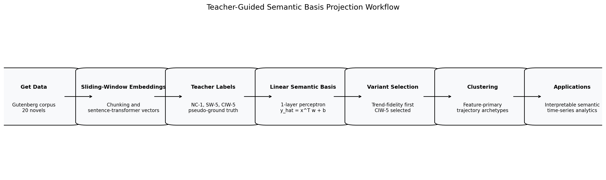
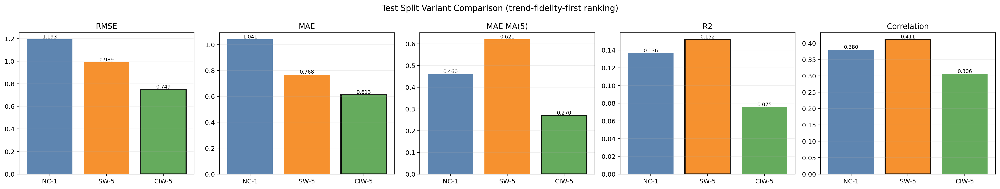
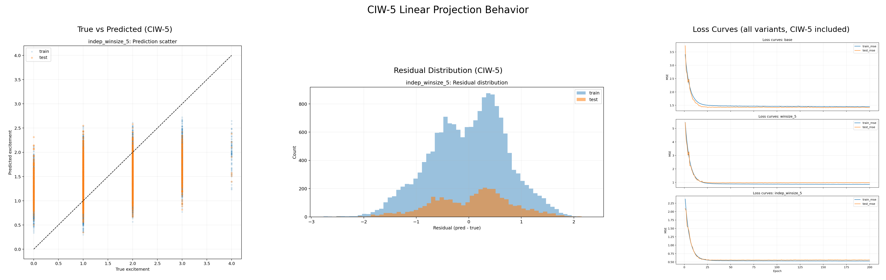
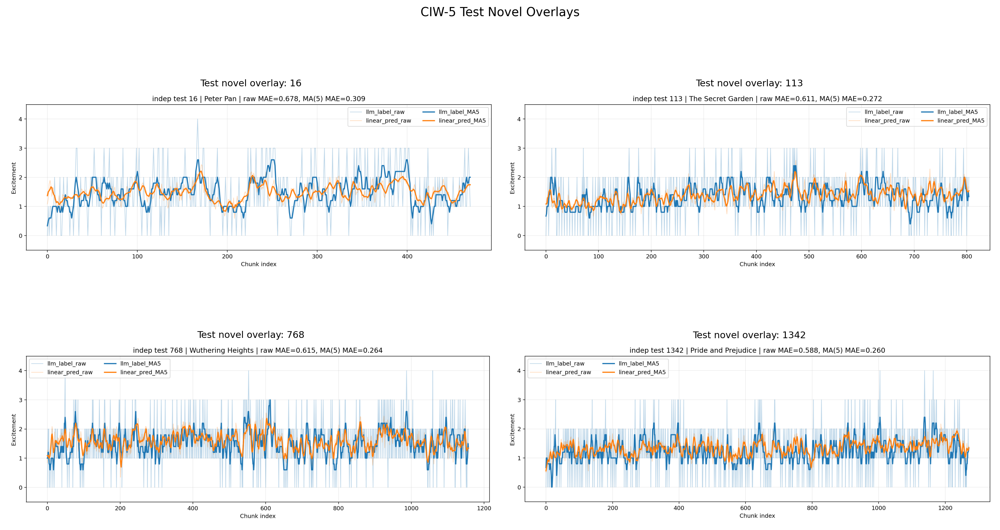
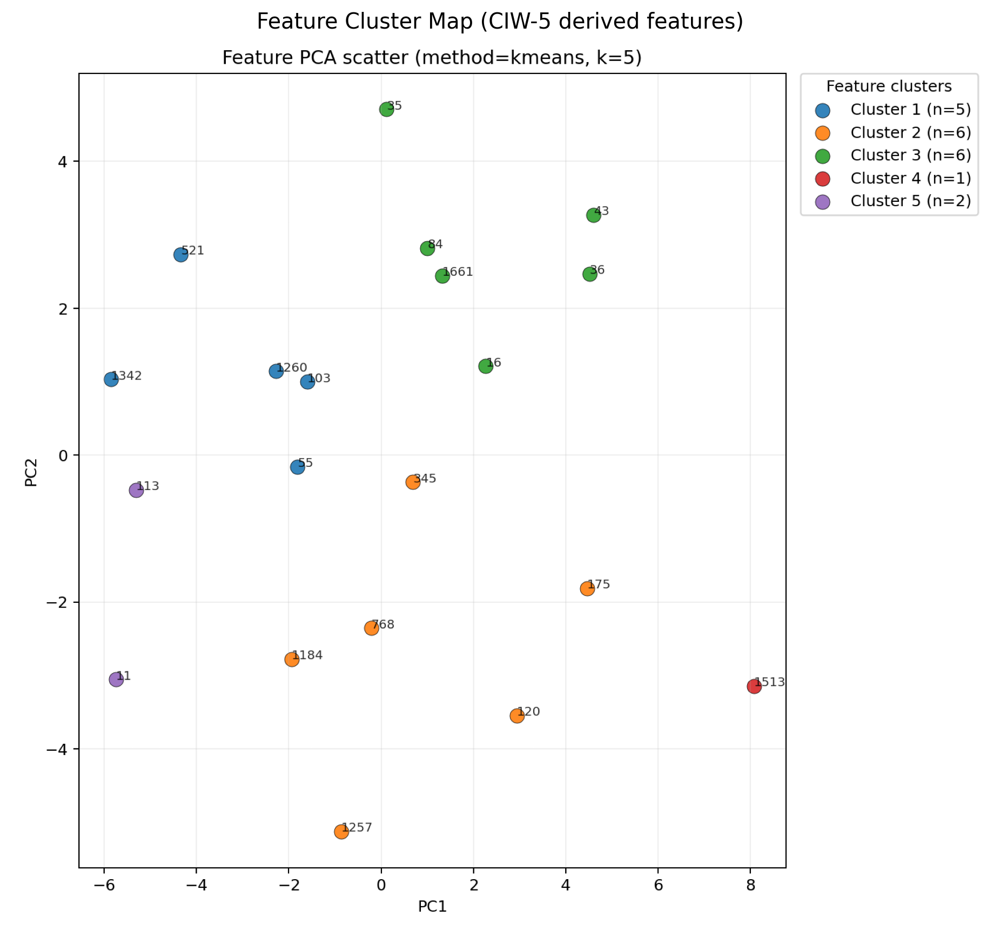
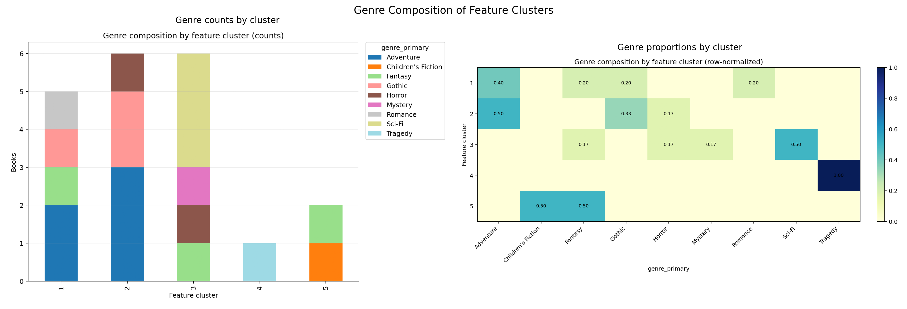
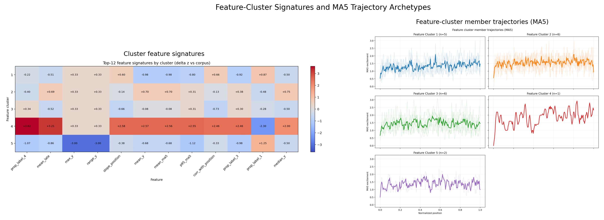
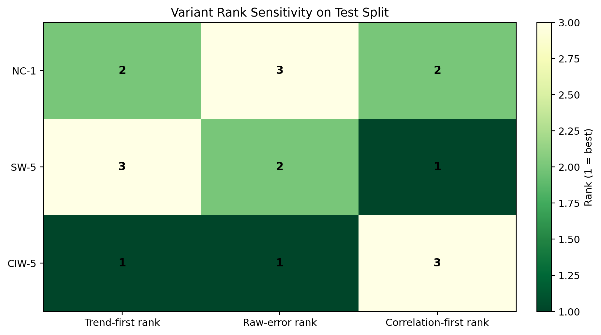
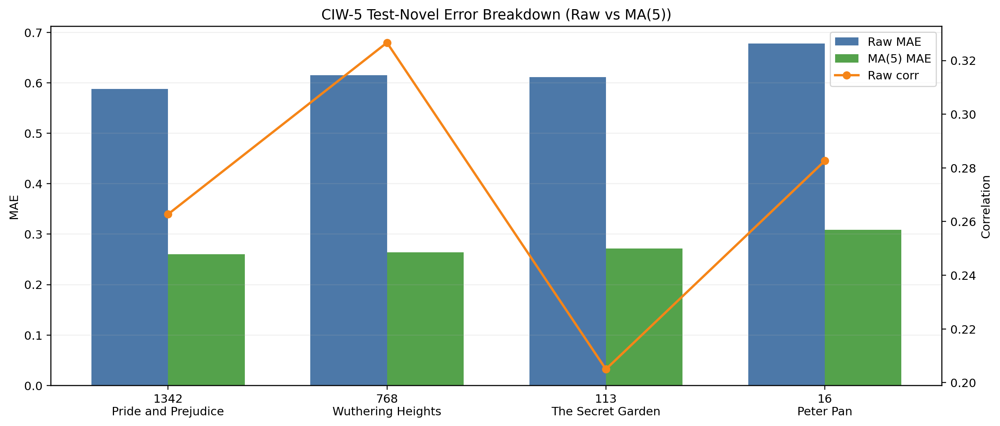
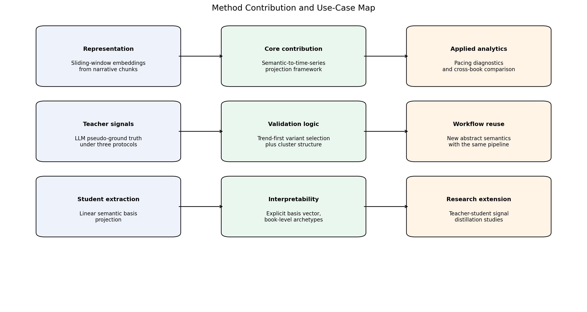

# Teacher-Guided Semantic Basis Projection: A General Semantic-to-Time-Series Framework (Excitement Case Study)

## Executive Abstract
This report presents a full project narrative for a method that maps abstract semantic constructs into interpretable time series. The concrete case study is narrative excitement, but the method is intentionally formulated as a general framework. The pipeline starts from long-form text, constructs sliding-window embedding trajectories, produces LLM teacher labels under three protocols, learns a linear semantic basis projection with a one-layer perceptron, selects the best teacher protocol using trend-fidelity criteria, and then analyzes structure through unsupervised clustering.

The central hypothesis is that sentence-embedding geometry contains latent semantic directions for abstract concepts such as excitement. Instead of maximizing variance as PCA does, this work optimizes semantic alignment to teacher labels. Under the locked selection rule, CIW-5 is selected as the primary teacher protocol. The results support a practical workflow for teacher-guided, interpretable semantic signal extraction from embeddings.

## 1. Project Objective and Contribution Statement
The project objective is to establish and evaluate a reproducible method for converting abstract semantics into chunk-level time-series signals that are interpretable, measurable, and suitable for downstream analysis. This differs from conventional document-level sentiment analysis because the focus is trajectory behavior across narrative progression.

Main contribution of this stage:
1. A teacher-guided semantic basis projection formulation that is simple and explicit.
2. A variant-comparison protocol for teacher labels that prioritizes trend fidelity.
3. A clustering analysis layer over the selected signal to derive pacing archetypes and genre-linked structure.
4. A packaging workflow where every claim is mapped to reproducible artifacts.

## 2. Problem Formulation and Hypothesis
Let `x_t ∈ R^D` be the sentence embedding of chunk `t` for a book. The student model predicts semantic intensity with a single linear map:

`ŷ_t = x_t^T w + b`

where `w ∈ R^D` is the semantic basis vector and `b` is a scalar bias. Training minimizes mean squared error with L2 regularization:

`L = (1/N) Σ_t (ŷ_t - y_t)^2 + λ ||w||_2^2`

Hypothesis: if excitement is encoded in embedding geometry, a supervised linear axis should recover trend-aligned signals against teacher labels. This objective is distinct from PCA, which optimizes variance explanation without semantic supervision.

## 3. Data and Representation Pipeline
The corpus contains `20` novels and `21337` total chunks across all books. Chunk counts range from `255` to `4608` per book. Novel-level split is deterministic and leakage-safe, with `16` train novels and `4` test novels.

Split profile:

| split | n_books | n_chunks | median_T | min_T | max_T |
|---|---|---|---|---|---|
| test | 4 | 3706 | 981.500 | 471 | 1272 |
| train | 16 | 17631 | 717.000 | 255 | 4608 |

Representation route used in this report:
`Data -> Sliding-window embeddings -> Teacher pseudo-ground truth variants -> Linear semantic basis projection -> Variant selection -> Clustering -> Utility analysis`

## 4. Teacher Protocols and Pseudo-Ground-Truth Design
Teacher labels are generated by LLM judging on a 0-4 excitement scale. Labels are treated as pseudo-ground truth because they are model-derived supervision, not direct human annotation. Three variants are used:
1. `NC-1`: No-Context Chunk Teacher Labels (`label.npy`).
2. `SW-5`: Shared-Window Labels (`label_winsize_5.npy`).
3. `CIW-5`: Context-Window Independent Labels (`label_indep_winsize_5.npy`).

The variant study is essential because teacher protocol changes alter supervision smoothness, local consistency, and calibration behavior.

## 5. Student Model: Semantic Basis Extraction
The student is a one-layer perceptron over standardized embeddings. The learned vector `w` is interpreted as a semantic basis direction in embedding space rather than a black-box latent representation. This gives a clear mapping between representation and predicted signal while preserving computational simplicity.

Training configuration for CIW-5 model (from saved model artifact):
1. `seed = 42`
2. `lr = 0.01000`
3. `epochs = 200`
4. `batch_size = 4096`
5. `weight_decay = 0.000100`

## 6. Evaluation Protocol and Trend-Fidelity Criterion
Primary selection policy is trend-fidelity-first on test data with MA(5) smoothing. For each variant, ranking is determined by:
1. Lowest `MAE_MA5`
2. Then lowest raw `MAE`
3. Then lowest `RMSE`

Secondary diagnostics (`R2`, correlation) are reported for context but do not override the primary criterion.

## 7. Variant Study Results and Selection Rationale
Test-split variant diagnostics:

| variant_code | rmse | mae | mae_ma5 | r2 | corr | rank_trend_primary | rank_raw_error | rank_corr |
|---|---|---|---|---|---|---|---|---|
| CIW-5 | 0.749 | 0.613 | 0.270 | 0.075 | 0.306 | 1 | 1 | 3 |
| NC-1 | 1.193 | 1.041 | 0.460 | 0.136 | 0.380 | 2 | 3 | 2 |
| SW-5 | 0.989 | 0.768 | 0.621 | 0.152 | 0.411 | 3 | 2 | 1 |

Interpretation:
1. `CIW-5` ranks first by the locked trend-fidelity rule.
2. `CIW-5` test raw metrics are `RMSE=0.749`, `MAE=0.613`.
3. `CIW-5` trend metric is `MAE_MA5=0.270`, with raw-to-smoothed drop `0.343`.
4. `selected_variant_code = CIW-5` based on deterministic ranking.

## 8. Selected Variant (CIW-5) Deep Behavior Analysis
Per-test-book CIW-5 diagnostics are summarized below. `error_gap_raw_vs_ma` indicates the improvement from raw MAE to MA(5) MAE.

| book_id | title | T | mae | mae_ma | corr | error_gap_raw_vs_ma |
|---|---|---|---|---|---|---|
| 1342 | Pride and Prejudice | 1272 | 0.588 | 0.260 | 0.263 | 0.327 |
| 768 | Wuthering Heights | 1158 | 0.615 | 0.264 | 0.327 | 0.351 |
| 113 | The Secret Garden | 805 | 0.611 | 0.272 | 0.205 | 0.339 |
| 16 | Peter Pan | 471 | 0.678 | 0.309 | 0.283 | 0.369 |

This table supports two conclusions:
1. Trend-level agreement is consistently better than chunk-level agreement.
2. Book-level heterogeneity remains substantial, so deployment should prioritize comparative trend profiling over absolute chunk score decisions.

## 9. Clustering on Selected Signal and Archetype Interpretation
Clustering in the final presentation is applied to CIW-5 derived trajectory features using the feature branch.

Clustering input definition in this project:
1. Feature-branch clustering is performed on a per-book feature vector extracted from the **raw CIW-5 trajectory**.
2. This feature vector also includes three MA(5)-derived summary features (`mean_ma5`, `std_ma5`, `p95_ma5`).
3. Therefore, clustering is **not** performed on CIW-5 MA(5)-only sequence values. It is performed on a mixed descriptor set dominated by raw CIW-5 statistics plus MA(5) summaries.
4. MA(5) trajectories are used for additional visualization and archetype interpretation panels.

Extracted per-book features from CIW-5 time series:
1. Length and level/distribution: `T`, `mean_y`, `std_y`, `median_y`, `iqr_y`, `min_y`, `max_y`, `p10_y`, `p90_y`, `range_y`.
2. Label composition: `prop_label_0`, `prop_label_1`, `prop_label_2`, `prop_label_3`, `prop_label_4`, `entropy_labels`.
3. Local dynamics: `mean_abs_diff`, `std_diff`, `p95_abs_diff`, `jump_ge_2_rate`, `up_rate`, `down_rate`, `flat_rate`, `lag1_autocorr`, `sign_change_rate`.
4. Position/trend structure: `corr_with_position`, `slope_position`, `mean_early`, `mean_mid`, `mean_late`.
5. Smoothed summaries (MA5): `mean_ma5`, `std_ma5`, `p95_ma5`.

Selected feature configuration: method `kmeans`, `k=5`, silhouette `0.260`, stability ARI `0.893`.

Cluster summary (feature-primary):

| cluster | n_books | top_feature_1 | top_feature_2 | top_feature_3 | representative_book | dominant_genre | dominant_genre_prop |
|---|---|---|---|---|---|---|---|
| 1 | 5 | mean_early | p90_y | mean_ma5 | 1260 \| Jane Eyre | Adventure | 0.400 |
| 2 | 6 | prop_label_2 | prop_label_0 | p10_y | 768 \| Wuthering Heights | Adventure | 0.500 |
| 3 | 6 | std_diff | jump_ge_2_rate | mean_abs_diff | 1661 \| The Adventures of Sherlock Holmes | Sci-Fi | 0.500 |
| 4 | 1 | prop_label_4 | mean_late | slope_position | 1513 \| Romeo and Juliet | Tragedy | 1.000 |
| 5 | 2 | max_y | range_y | lag1_autocorr | 11 \| Alice's Adventures in Wonderland | Children's Fiction | 0.500 |

Reading guidance: feature clusters are interpreted through engineered trajectory descriptors and MA(5) member trajectories. This keeps the final presentation focused on interpretable archetypes from CIW-5 features.

## 10. Figure Explanations and Evidence
### Figure 1. Pipeline Overview

- What this figure shows: The full workflow from data ingestion to semantic time-series applications.
- How to read it: Read left to right. Each box is a stage and arrows indicate dependency flow.
- Interpretation and insight: The report contribution is centered on the supervised semantic-axis extraction stage, not on unsupervised variance decomposition.

### Figure 2. Variant Comparison on Test Split

- What this figure shows: Comparative test metrics for NC-1, SW-5, and CIW-5 across raw and smoothed errors plus correlation diagnostics.
- How to read it: For RMSE/MAE/MAE_MA5 lower is better. For R2/correlation higher is better. Selection still follows trend-first ranking.
- Interpretation and insight: CIW-5 is selected because it is best on the primary trend metric while remaining competitive on raw metrics.

### Figure 3. CIW-5 Model Behavior

- What this figure shows: Scatter, residual, and training diagnostics associated with the selected CIW-5 student model.
- How to read it: Use scatter for calibration spread, residual histogram for bias shape, and loss curves for optimization stability.
- Interpretation and insight: The model is stable and interpretable, but chunk-level residual spread confirms that trend-level interpretation is the safer use mode.

### Figure 4. CIW-5 Test Overlays

- What this figure shows: Overlay of teacher and student trajectories for all held-out test novels.
- How to read it: Track directional movement and pacing regions instead of exact pointwise matching.
- Interpretation and insight: The selected model preserves broad narrative dynamics on unseen novels, which justifies trend-level utility claims.

### Figure 5. Feature Cluster Map

- What this figure shows: Feature-space map of books with selected feature-cluster assignments.
- How to read it: Each point is one book and color indicates cluster identity.
- Interpretation and insight: The map provides the geometric context for archetype interpretation in the cluster summary table.

### Figure 6. Genre Composition by Cluster

- What this figure shows: Cluster composition shown in both counts and row-normalized proportions by `genre_primary`.
- How to read it: Left panel shows absolute counts. Right panel shows within-cluster composition.
- Interpretation and insight: Genre concentration varies across clusters, supporting the claim that the extracted signal captures narratively meaningful structure.

### Figure 7. Feature Cluster Signatures and Member Trajectories

- What this figure shows: Top feature signatures by cluster together with MA(5) member-trajectory archetypes.
- How to read it: Use the signature panel to read which features distinguish each cluster, then inspect MA(5) trajectory panels for pacing shape patterns.
- Interpretation and insight: Together, these views connect feature-level semantics to observable cluster trajectory behavior in CIW-5.

### Figure 8. Variant Rank Sensitivity

- What this figure shows: Rank matrix of variants under trend-first, raw-error-first, and correlation-first criteria.
- How to read it: Lower rank numbers are better. Compare rows (variants) across columns (criteria).
- Interpretation and insight: This figure makes selection logic transparent and shows how conclusions shift under alternate objectives.

### Figure 9. CIW-5 Per-Book Test Breakdown

- What this figure shows: Book-level raw MAE and MA(5) MAE bars with correlation line for the test set.
- How to read it: Compare paired bars within each book to inspect smoothing gains and use line markers for correlation context.
- Interpretation and insight: The figure quantifies where trend-level gains are strongest and where residual uncertainty remains.

### Figure 10. Contribution and Use-Cases Map

- What this figure shows: Conceptual mapping from method components to research contributions and practical uses.
- How to read it: Read each row as input component -> methodological contribution -> usage pathway.
- Interpretation and insight: The project is positioned as a reusable semantic-to-time-series framework, with excitement as the demonstrated task.

### Figure 11. Feature Cluster Member Trajectories (MA5)

- What this figure shows: A dedicated high-resolution view of MA(5) member trajectories for each feature cluster.
- How to read it: Each subplot represents one feature cluster with thin lines for member books and a bold centroid trajectory.
- Interpretation and insight: This figure provides direct visual evidence of pacing archetypes that define the final feature-cluster interpretation.

## 11. Utility, Generalization, and Deployment Scenarios
The method is useful when a team needs interpretable, chunk-level semantic trajectories from high-dimensional embeddings and cannot afford heavy black-box sequence models. Since the student is linear and trained with explicit supervision, each run produces a transparent semantic basis that is fast to apply to new data.

Potential use scenarios:
1. Narrative pacing analytics for editorial workflow support.
2. Cross-book comparative profiling for literary or media research.
3. Teacher-student distillation pipeline for other abstract constructs (for example suspense, urgency, or emotional intensity).
4. Lightweight semantic monitoring where interpretability and reproducibility are mandatory.

## 12. Limitations and Threats to Validity
1. Teacher labels are pseudo-ground truth and can contain systematic LLM bias.
2. Corpus size is small (`20` novels), limiting external validity.
3. The student is linear, so nonlinear semantic structure may be underfit.
4. Cluster structure is sensitive to feature design and sample size.
5. Correlation and R2 behavior can diverge from trend-error objectives, so objective choice must be explicit.

## 13. Reproducibility and Artifact Guide
Generated in stage `10_final_teacher_guided_semantic_basis_report.ipynb` with deterministic configuration (`SEED=42`, `MA_WINDOW=5`).

Core evidence artifacts:
1. `../outputs/final_report/tables/variant_selection_summary.csv`
2. `../outputs/final_report/tables/variant_selection_diagnostics.csv`
3. `../outputs/final_report/tables/dataset_profile_for_report.csv`
4. `../outputs/final_report/tables/ciw5_per_book_deepdive.csv`
5. `../outputs/final_report/tables/cluster_summary_for_report.csv`
6. `../outputs/final_report/tables/key_results_registry.csv`
7. `../outputs/final_report/tables/method_claims_checklist.csv`
8. `../outputs/final_report/tables/report_integrity_checks.csv`

Related appendix: `docs/OTHER_EXPERIMENTS.md` documents Twist Signal and PCA tracks as secondary experiments, intentionally separated from the main claim path.

## 14. Conclusion
This project demonstrates a concrete path for converting abstract semantics into interpretable time series by combining embedding trajectories, LLM teacher supervision, and linear semantic basis extraction. In this case study, CIW-5 is the most suitable teacher protocol under trend-first selection. The resulting signal supports meaningful clustering and practical downstream interpretation. More broadly, the workflow provides a reusable pattern for teacher-guided semantic projection where transparency, reproducibility, and analytical utility are first-class goals.

## Claim Provenance
- Core registry: `../outputs/final_report/tables/key_results_registry.csv`
- Claim checklist: `../outputs/final_report/tables/method_claims_checklist.csv`
- Report integrity: `../outputs/final_report/tables/report_integrity_checks.csv`
