# Novel Stacked Twist Signal Interpretation

## Overview
This document interprets 20 stacked per-novel plots generated from `k=5,7,11`. Each figure has three vertical panels for one novel, and each panel overlays `s_t` (Twist Signal) and `a_t` (Twist Acceleration).

How to read each panel:
- `s_t` tracks novelty versus recent narrative context.
- `a_t` tracks local novelty acceleration between consecutive chunks.
- Peak markers indicate top acceleration points for that `k`.

## Global Highlights

Top 3 by novelty (`mean_s`, k=7):
- 35 | The Time Machine | mean_s_k7=0.222
- 345 | Dracula | mean_s_k7=0.222
- 175 | The Phantom of the Opera | mean_s_k7=0.210

Lowest 3 by novelty (`mean_s`, k=7):
- 1342 | Pride and Prejudice | mean_s_k7=0.142
- 1257 | The Three Musketeers | mean_s_k7=0.164
- 768 | Wuthering Heights | mean_s_k7=0.165

Top 3 by acceleration spikes (`max_a`, k=7):
- 84 | Frankenstein; Or, The Modern Prometheus | max_a_k7=0.491
- 113 | The Secret Garden | max_a_k7=0.467
- 43 | The Strange Case of Dr. Jekyll and Mr. Hyde | max_a_k7=0.434

Strongest k-sensitivity (`|delta_mean_s_k11_k5|`):
- 84 | Frankenstein; Or, The Modern Prometheus | delta_mean_s_k11_k5=0.025
- 35 | The Time Machine | delta_mean_s_k11_k5=0.024
- 521 | Robinson Crusoe | delta_mean_s_k11_k5=0.023

Strongest k-sensitivity (`|delta_max_a_k11_k5|`):
- 175 | The Phantom of the Opera | delta_max_a_k11_k5=-0.064
- 103 | Around the World in Eighty Days | delta_max_a_k11_k5=-0.061
- 1513 | Romeo and Juliet | delta_max_a_k11_k5=-0.054

Caveats:
- Labels are relative to this 20-book corpus and current embedding/signal settings.
- Peak extraction uses top-3 acceleration peaks and minimum separation defaults from the pipeline.
- Interpretive statements are descriptive and should be validated with additional settings/checks.

## Per-Novel Interpretations

### [11] Alice's Adventures in Wonderland

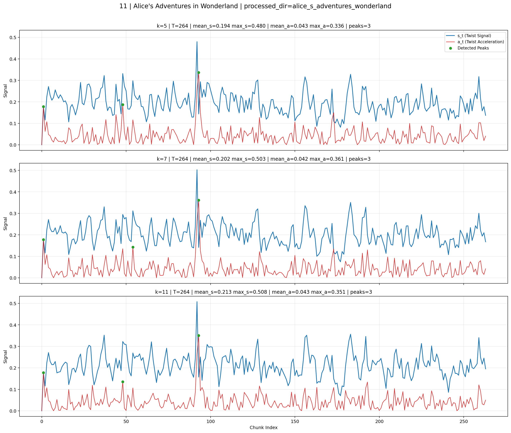

- Novelty level (k=7 mean_s=0.202): **High**
- Acceleration/volatility level (k=7 max_a=0.361): **Medium**
- Peak timing profile (k=7): Early-weighted (avg=0.19)
- k-dependence pattern: Increasing with larger k (delta_mean_s=0.019, delta_max_a=0.014)
- What stands out: Alice's Adventures in Wonderland is consistently novel but less spike-driven than the most volatile books.

### [16] Peter Pan

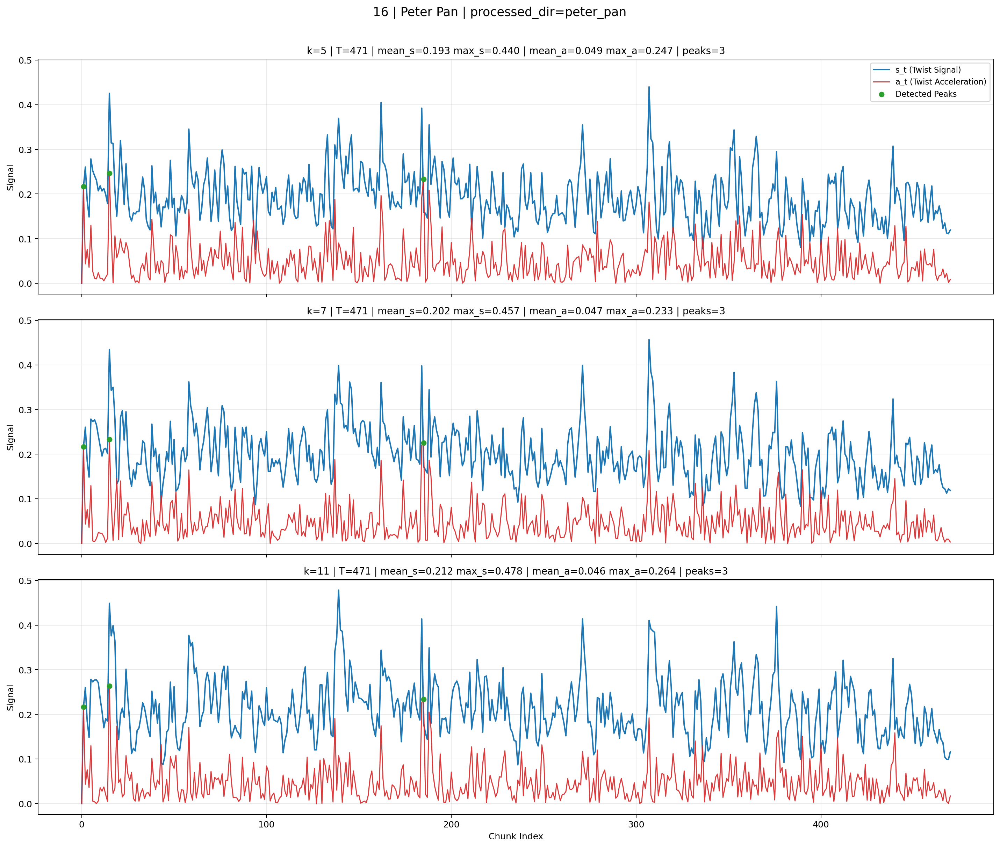

- Novelty level (k=7 mean_s=0.202): **Medium**
- Acceleration/volatility level (k=7 max_a=0.233): **Low**
- Peak timing profile (k=7): Early-weighted (avg=0.14)
- k-dependence pattern: Increasing with larger k (delta_mean_s=0.019, delta_max_a=0.017)
- What stands out: Peter Pan sits in a middle regime with increasing with larger k behavior across window sizes.

### [35] The Time Machine

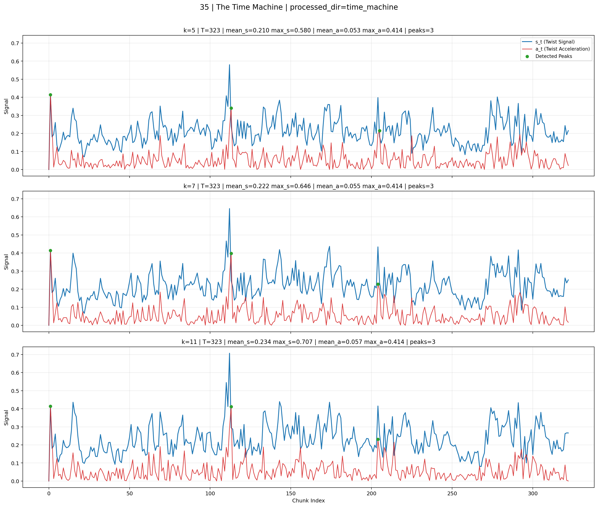

- Novelty level (k=7 mean_s=0.222): **High**
- Acceleration/volatility level (k=7 max_a=0.414): **High**
- Peak timing profile (k=7): Early-weighted (avg=0.33)
- k-dependence pattern: Mixed sensitivity across k (delta_mean_s=0.024, delta_max_a=0.000)
- What stands out: The Time Machine combines high novelty and sharp shifts, forming a jagged trajectory profile.

### [36] The War of the Worlds

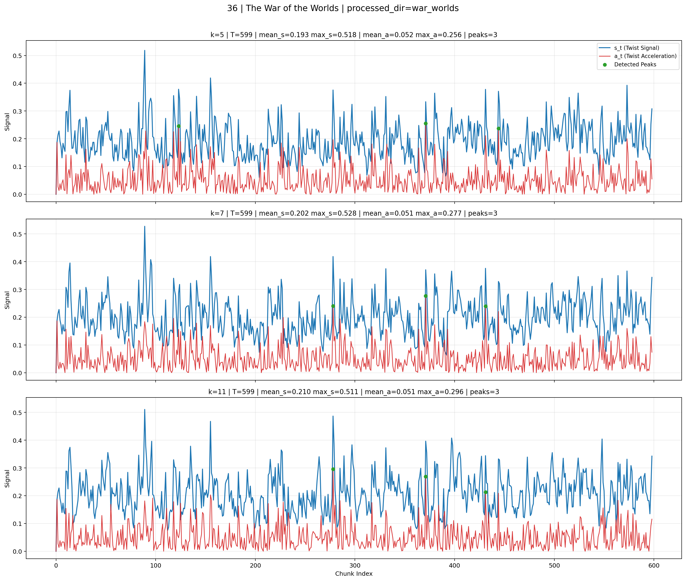

- Novelty level (k=7 mean_s=0.202): **Medium**
- Acceleration/volatility level (k=7 max_a=0.277): **Low**
- Peak timing profile (k=7): Mid-story weighted (avg=0.60)
- k-dependence pattern: Increasing with larger k (delta_mean_s=0.017, delta_max_a=0.040)
- What stands out: The War of the Worlds sits in a middle regime with increasing with larger k behavior across window sizes.

### [43] The Strange Case of Dr. Jekyll and Mr. Hyde

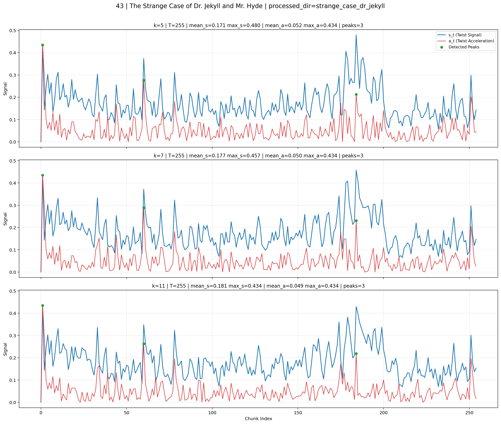

- Novelty level (k=7 mean_s=0.177): **Low**
- Acceleration/volatility level (k=7 max_a=0.434): **High**
- Peak timing profile (k=7): Distributed across early-to-late arc (avg=0.32)
- k-dependence pattern: Stable across k (delta_mean_s=0.010, delta_max_a=0.000)
- What stands out: The Strange Case of Dr. Jekyll and Mr. Hyde has a calmer baseline punctuated by concentrated bursts of change.

### [55] The Wonderful Wizard of Oz

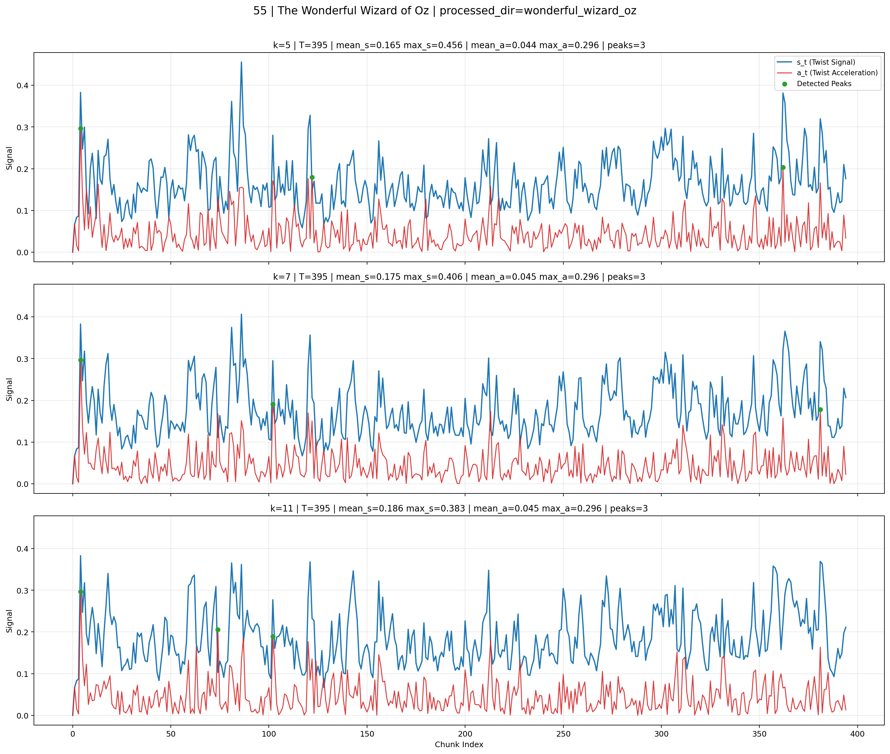

- Novelty level (k=7 mean_s=0.175): **Low**
- Acceleration/volatility level (k=7 max_a=0.296): **Low**
- Peak timing profile (k=7): Distributed across early-to-late arc (avg=0.41)
- k-dependence pattern: Mixed sensitivity across k (delta_mean_s=0.021, delta_max_a=0.000)
- What stands out: The Wonderful Wizard of Oz shows a smoother, lower-volatility progression relative to the corpus.

### [84] Frankenstein; Or, The Modern Prometheus

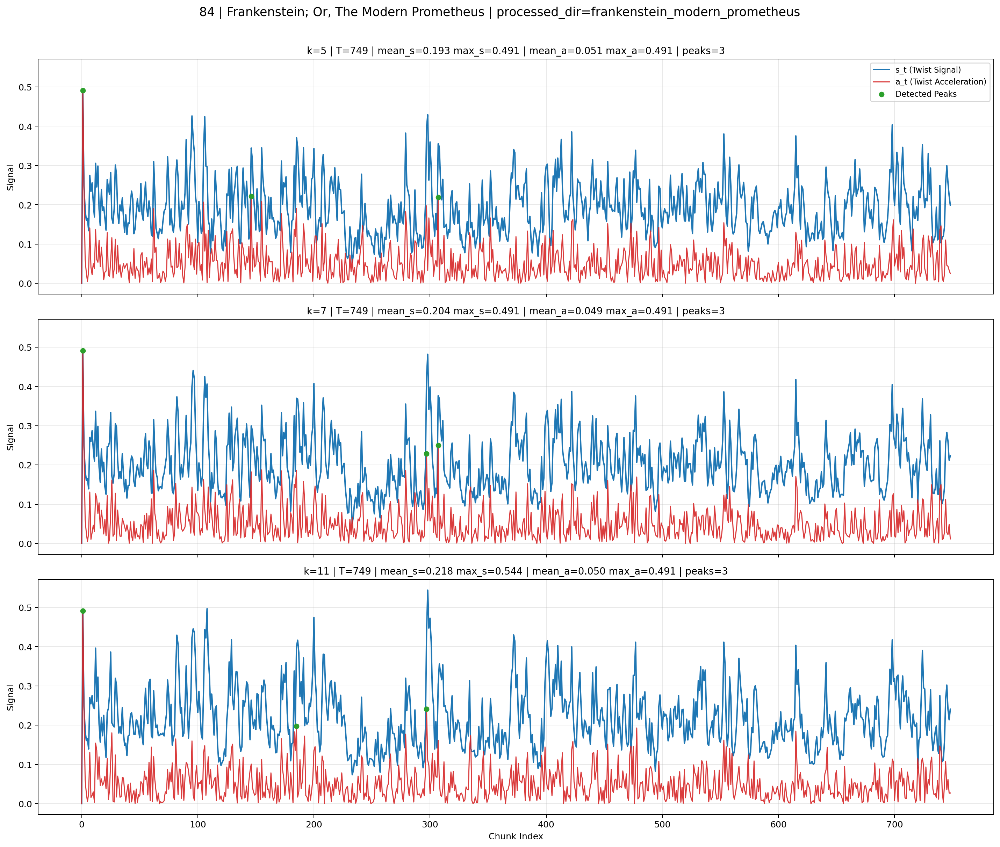

- Novelty level (k=7 mean_s=0.204): **High**
- Acceleration/volatility level (k=7 max_a=0.491): **High**
- Peak timing profile (k=7): Early-weighted (avg=0.27)
- k-dependence pattern: Mixed sensitivity across k (delta_mean_s=0.025, delta_max_a=0.000)
- What stands out: Frankenstein; Or, The Modern Prometheus combines high novelty and sharp shifts, forming a jagged trajectory profile.

### [103] Around the World in Eighty Days

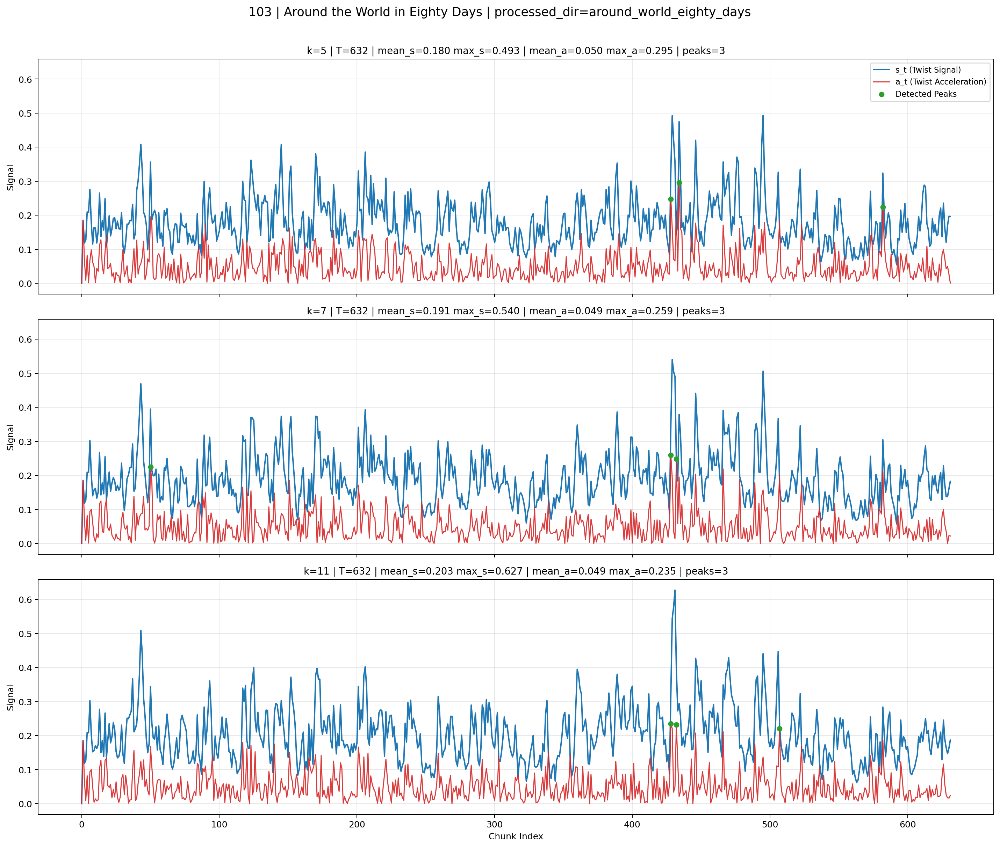

- Novelty level (k=7 mean_s=0.191): **Medium**
- Acceleration/volatility level (k=7 max_a=0.259): **Low**
- Peak timing profile (k=7): Distributed across early-to-late arc (avg=0.48)
- k-dependence pattern: Mixed sensitivity across k (delta_mean_s=0.023, delta_max_a=-0.061)
- What stands out: Around the World in Eighty Days sits in a middle regime with mixed sensitivity across k behavior across window sizes.

### [113] The Secret Garden

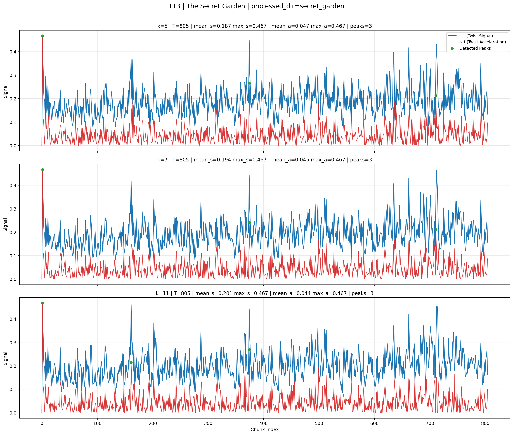

- Novelty level (k=7 mean_s=0.194): **Medium**
- Acceleration/volatility level (k=7 max_a=0.467): **High**
- Peak timing profile (k=7): Distributed across early-to-late arc (avg=0.45)
- k-dependence pattern: Stable across k (delta_mean_s=0.015, delta_max_a=0.000)
- What stands out: The Secret Garden sits in a middle regime with stable across k behavior across window sizes.

### [120] Treasure Island

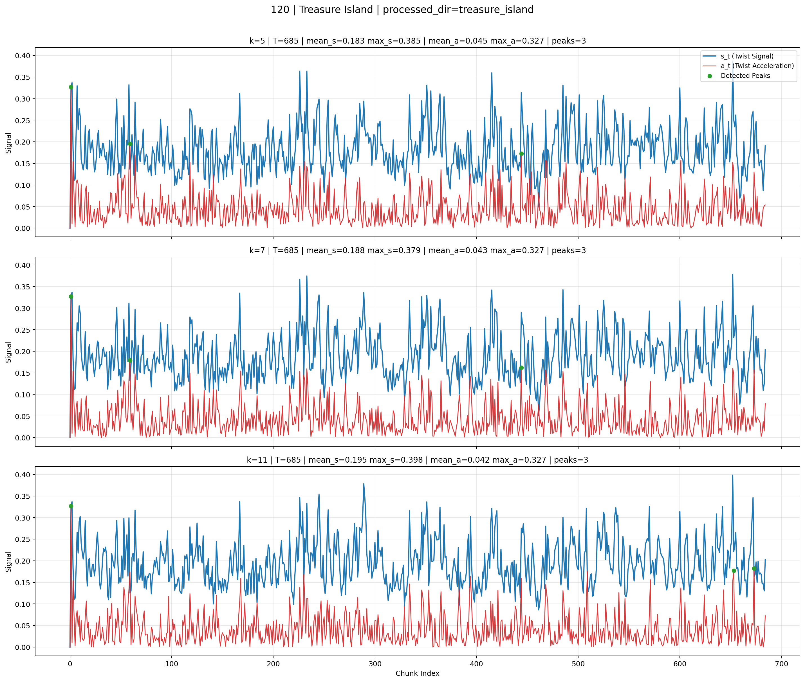

- Novelty level (k=7 mean_s=0.188): **Medium**
- Acceleration/volatility level (k=7 max_a=0.327): **Medium**
- Peak timing profile (k=7): Early-weighted (avg=0.25)
- k-dependence pattern: Stable across k (delta_mean_s=0.012, delta_max_a=0.000)
- What stands out: Treasure Island sits in a middle regime with stable across k behavior across window sizes.

### [175] The Phantom of the Opera

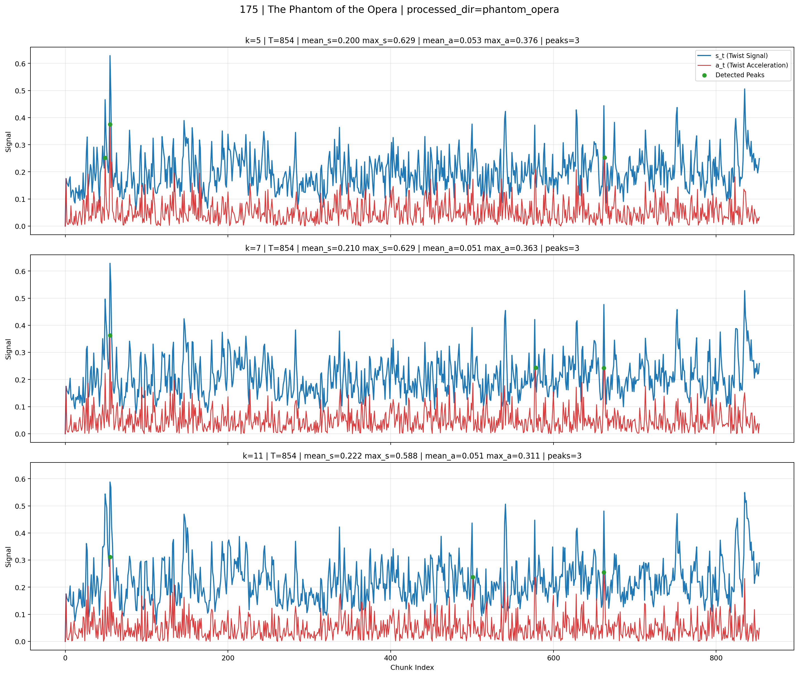

- Novelty level (k=7 mean_s=0.210): **High**
- Acceleration/volatility level (k=7 max_a=0.363): **High**
- Peak timing profile (k=7): Distributed across early-to-late arc (avg=0.51)
- k-dependence pattern: Mixed sensitivity across k (delta_mean_s=0.022, delta_max_a=-0.064)
- What stands out: The Phantom of the Opera combines high novelty and sharp shifts, forming a jagged trajectory profile.

### [345] Dracula

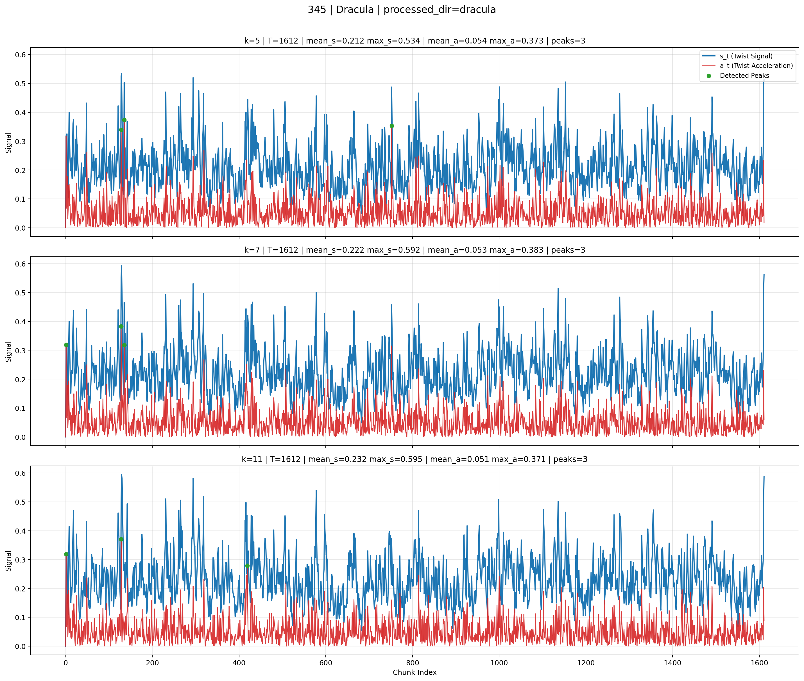

- Novelty level (k=7 mean_s=0.222): **High**
- Acceleration/volatility level (k=7 max_a=0.383): **High**
- Peak timing profile (k=7): Early-weighted (avg=0.05)
- k-dependence pattern: Mixed sensitivity across k (delta_mean_s=0.021, delta_max_a=-0.003)
- What stands out: Dracula combines high novelty and sharp shifts, forming a jagged trajectory profile.

### [521] Robinson Crusoe

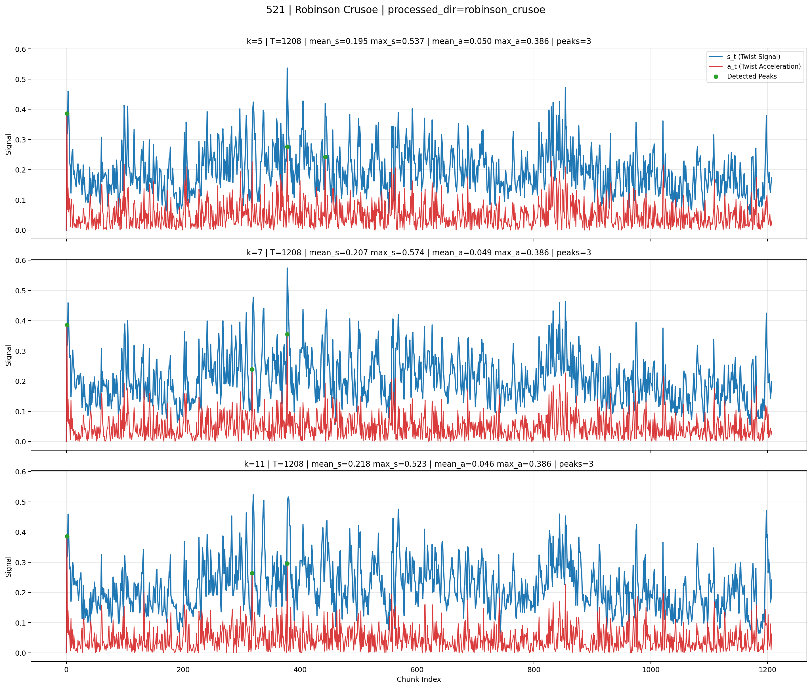

- Novelty level (k=7 mean_s=0.207): **High**
- Acceleration/volatility level (k=7 max_a=0.386): **High**
- Peak timing profile (k=7): Early-weighted (avg=0.19)
- k-dependence pattern: Mixed sensitivity across k (delta_mean_s=0.023, delta_max_a=0.000)
- What stands out: Robinson Crusoe combines high novelty and sharp shifts, forming a jagged trajectory profile.

### [768] Wuthering Heights

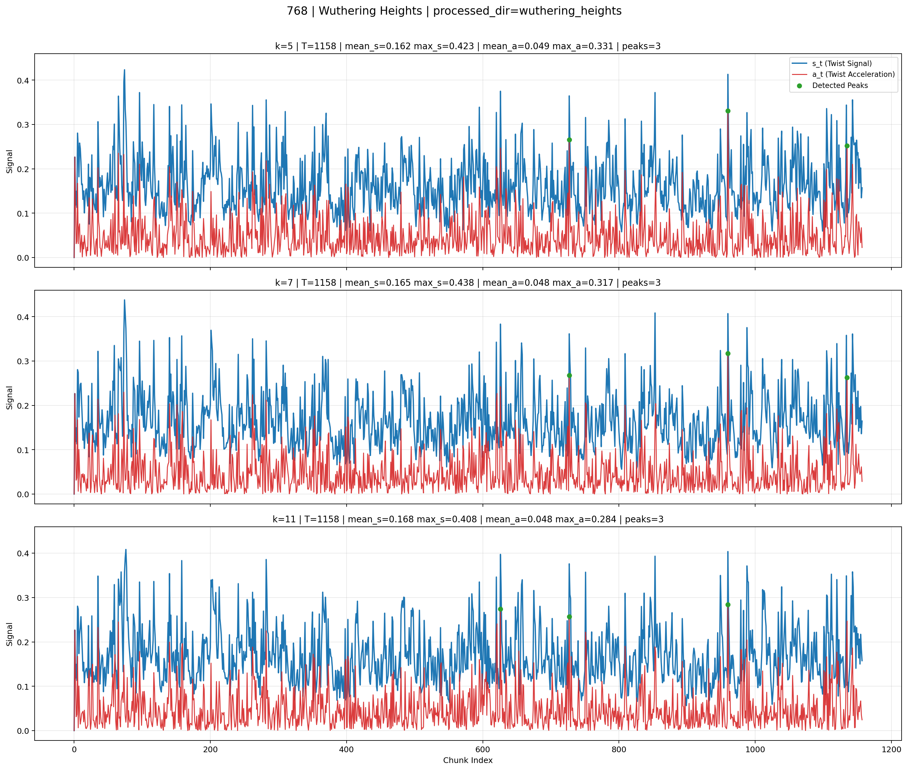

- Novelty level (k=7 mean_s=0.165): **Low**
- Acceleration/volatility level (k=7 max_a=0.317): **Medium**
- Peak timing profile (k=7): Late-weighted (avg=0.81)
- k-dependence pattern: Mixed sensitivity across k (delta_mean_s=0.006, delta_max_a=-0.047)
- What stands out: Wuthering Heights sits in a middle regime with mixed sensitivity across k behavior across window sizes.

### [1184] The Count of Monte Cristo

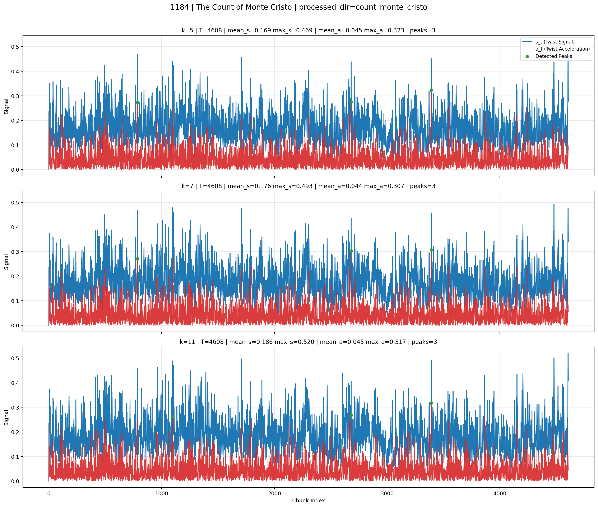

- Novelty level (k=7 mean_s=0.176): **Low**
- Acceleration/volatility level (k=7 max_a=0.307): **Low**
- Peak timing profile (k=7): Distributed across early-to-late arc (avg=0.50)
- k-dependence pattern: Mixed sensitivity across k (delta_mean_s=0.017, delta_max_a=-0.006)
- What stands out: The Count of Monte Cristo shows a smoother, lower-volatility progression relative to the corpus.

### [1257] The Three Musketeers

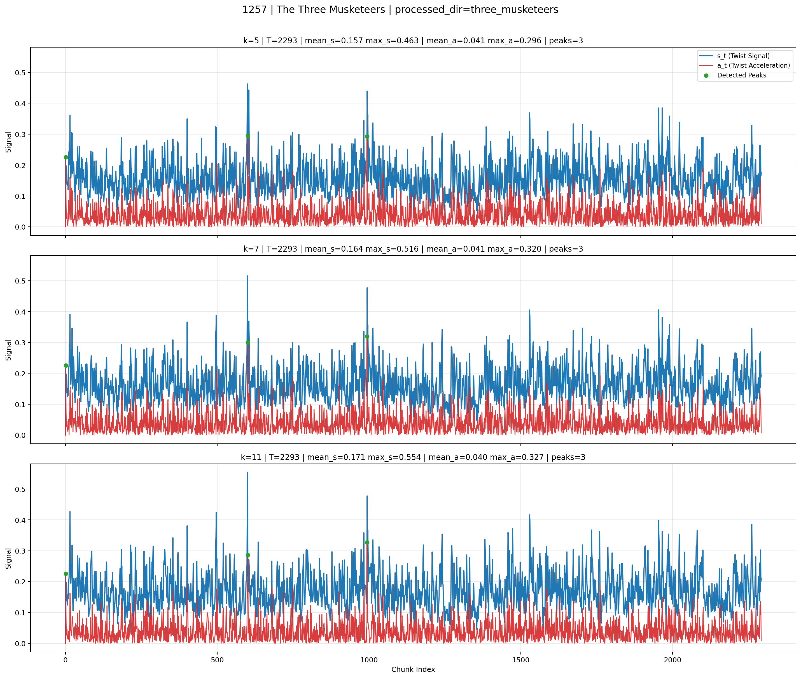

- Novelty level (k=7 mean_s=0.164): **Low**
- Acceleration/volatility level (k=7 max_a=0.320): **Medium**
- Peak timing profile (k=7): Early-weighted (avg=0.23)
- k-dependence pattern: Mixed sensitivity across k (delta_mean_s=0.014, delta_max_a=0.031)
- What stands out: The Three Musketeers sits in a middle regime with mixed sensitivity across k behavior across window sizes.

### [1260] Jane Eyre

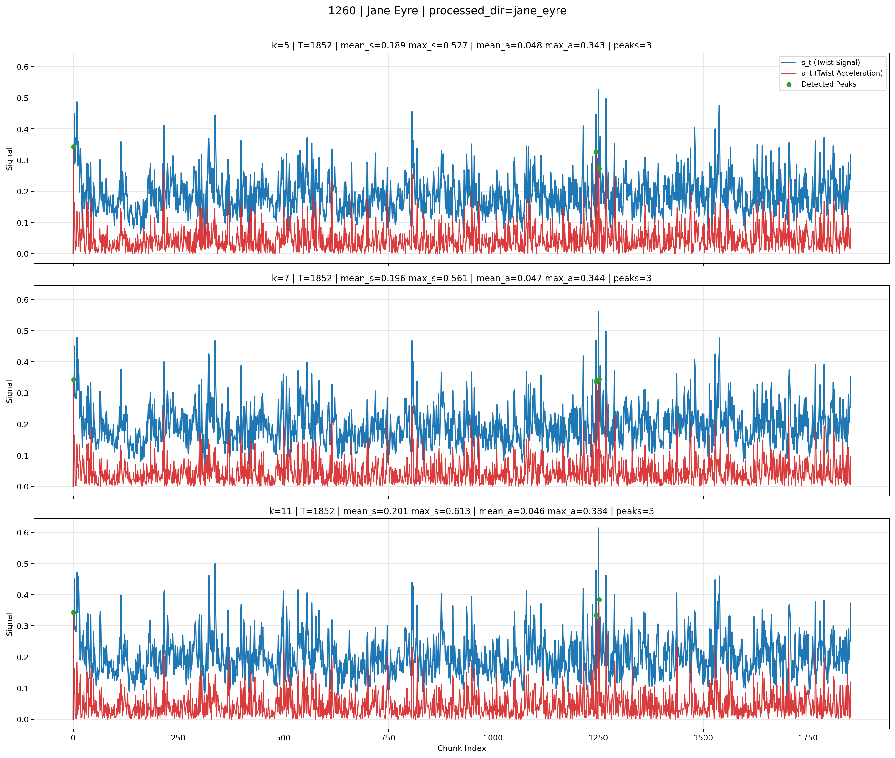

- Novelty level (k=7 mean_s=0.196): **Medium**
- Acceleration/volatility level (k=7 max_a=0.344): **Medium**
- Peak timing profile (k=7): Distributed across early-to-late arc (avg=0.45)
- k-dependence pattern: Mixed sensitivity across k (delta_mean_s=0.012, delta_max_a=0.042)
- What stands out: Jane Eyre sits in a middle regime with mixed sensitivity across k behavior across window sizes.

### [1342] Pride and Prejudice

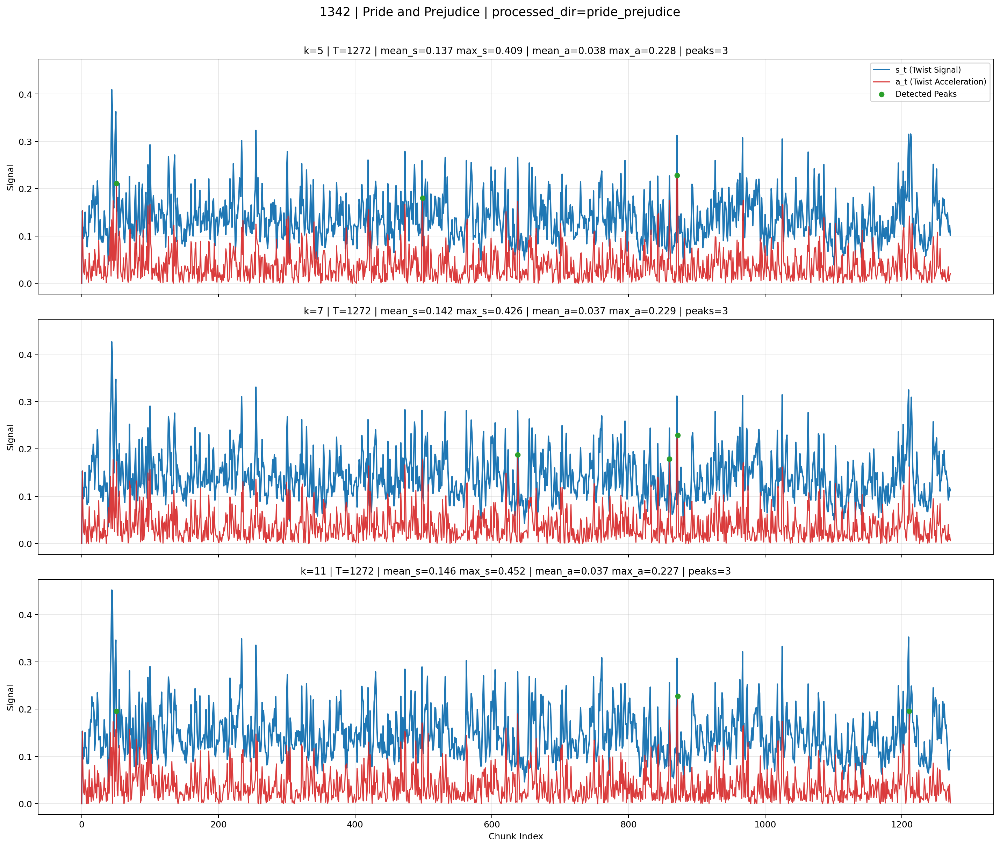

- Novelty level (k=7 mean_s=0.142): **Low**
- Acceleration/volatility level (k=7 max_a=0.229): **Low**
- Peak timing profile (k=7): Mid-story weighted (avg=0.62)
- k-dependence pattern: Stable across k (delta_mean_s=0.009, delta_max_a=-0.001)
- What stands out: Pride and Prejudice shows a smoother, lower-volatility progression relative to the corpus.

### [1513] Romeo and Juliet

- Novelty level (k=7 mean_s=0.175): **Low**
- Acceleration/volatility level (k=7 max_a=0.208): **Low**
- Peak timing profile (k=7): Distributed across early-to-late arc (avg=0.46)
- k-dependence pattern: Mixed sensitivity across k (delta_mean_s=0.015, delta_max_a=-0.054)
- What stands out: Romeo and Juliet shows a smoother, lower-volatility progression relative to the corpus.

### [1661] The Adventures of Sherlock Holmes

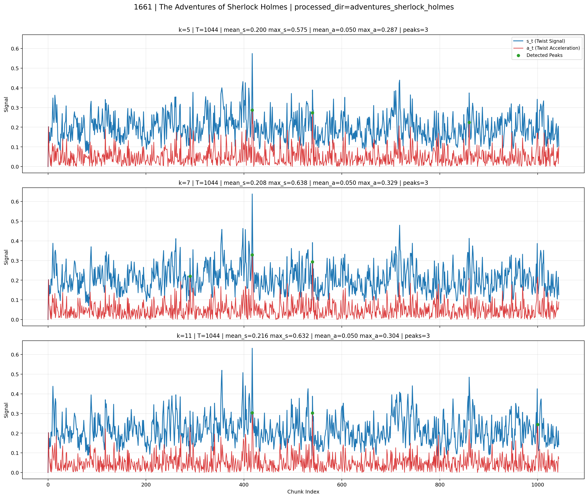

- Novelty level (k=7 mean_s=0.208): **High**
- Acceleration/volatility level (k=7 max_a=0.329): **Medium**
- Peak timing profile (k=7): Mid-story weighted (avg=0.40)
- k-dependence pattern: Increasing with larger k (delta_mean_s=0.016, delta_max_a=0.016)
- What stands out: The Adventures of Sherlock Holmes is consistently novel but less spike-driven than the most volatile books.

