# Output Interpretation Guide

## Scope
This document interprets all generated EDA plot outputs in `outputs/eda/figures/`, using supporting tables in `outputs/eda/tables/` and current run artifacts.

Run context:
- Books: 20
- Feature rows: 60 (`k in [5, 7, 11]`)
- Twist Signal model in current processed indexes: `sentence-transformers/all-mpnet-base-v2`

## High-Level Reading
Main takeaways from the current outputs:
1. The corpus is diverse but UK-heavy and novel-heavy.
2. Twist Signal feature intensity tends to increase from `k=5` to `k=11` for novelty (`mean_s`, `max_s`), while acceleration (`mean_a`) remains close.
3. Feature-based clustering is moderately structured and reasonably balanced; DTW hierarchical clustering is highly imbalanced (`17/1/1/1`).
4. Deep-dive representatives show different trajectory regimes: long gradual arcs vs short high-volatility trajectories.

## Plot-by-Plot Interpretation

### Corpus Composition
1. `corpus_composition_counts.png`
- What it shows: counts by `genre_primary`, `format`, `origin_country`, `original_language`.
- Interpretation:
  - `Adventure` is the largest genre block (5 books), then `Fantasy/Sci-Fi/Gothic` (3 each).
  - Format is dominated by `novel` (16/20), with sparse `novella/play/short-story collection`.
  - Country composition is UK-heavy (13/20), then France (4), US (2), Ireland (1).
  - Language split is English (16) vs French (4).
- Implication: downstream cluster differences can reflect corpus composition bias, not just narrative dynamics.
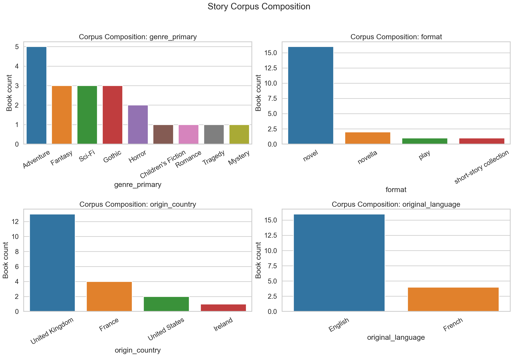

2. `publication_year_distribution.png`
- What it shows: publication-year histogram.
- Interpretation: wide temporal range from 1597 to 1911 (median ~1877.5), concentrated in the 19th century.
- Implication: year effects may confound stylistic/trajectory effects; include year in stratified analyses.
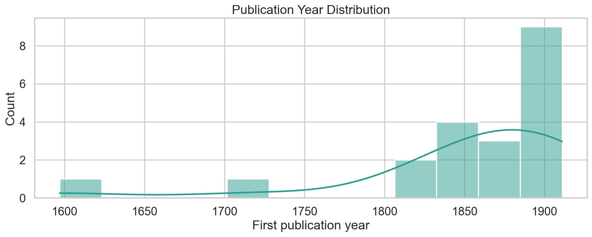

3. `metadata_rank_distributions.png`
- What it shows: distributions of `recognizability_rank`, `genre_clarity_rank`, `twist_peak_rank`.
- Interpretation: all three ranks are evenly spread 1-20 by design (mean/median ~10.5).
- Implication: these are balanced labels and useful for comparative slicing, but still human-assigned.
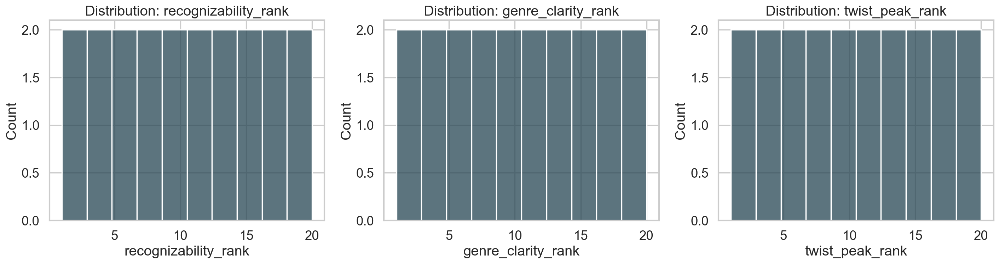

### Twist Signal Feature EDA
4. `twist_signal_feature_hist_by_k.png`
- What it shows: per-feature distributions across `k=5,7,11`.
- Interpretation:
  - `mean_s` shifts upward with larger `k` (means: `0.1829 -> 0.1910 -> 0.1998`).
  - `max_s` also increases with `k` on average.
  - `mean_a` remains in a narrow band (~0.047-0.048).
- Implication: context window changes baseline novelty scale; compare books within the same `k`.
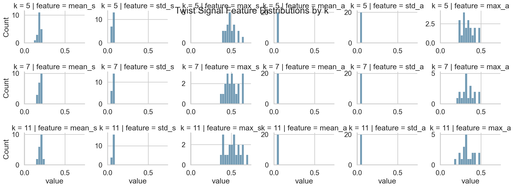

5. `twist_signal_feature_boxplots_by_k.png`
- What it shows: spread and outliers by `k`.
- Interpretation:
  - `max_a` has broad spread and strongest outlier behavior.
  - `std_s` and `std_a` retain meaningful cross-book separation across all `k`.
- Implication: volatility-oriented features are likely key drivers for clustering.
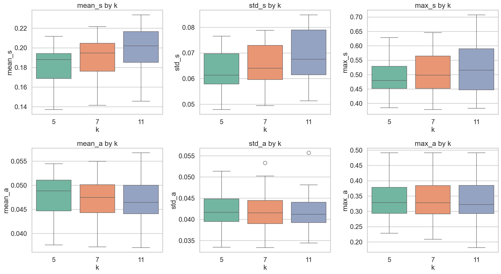

6. `twist_signal_feature_correlation_heatmap.png`
- What it shows: correlation structure across numeric Twist Signal features.
- Interpretation (strongest absolute relationships):
  - `mean_a` vs `std_a`: `0.889`
  - `std_s` vs `mean_a`: `0.819`
  - `mean_s` vs `std_s`: `0.719`
  - `mean_s` vs `max_s`: `0.670`
- Implication: novelty and acceleration are linked but non-redundant; keep both families in feature space.
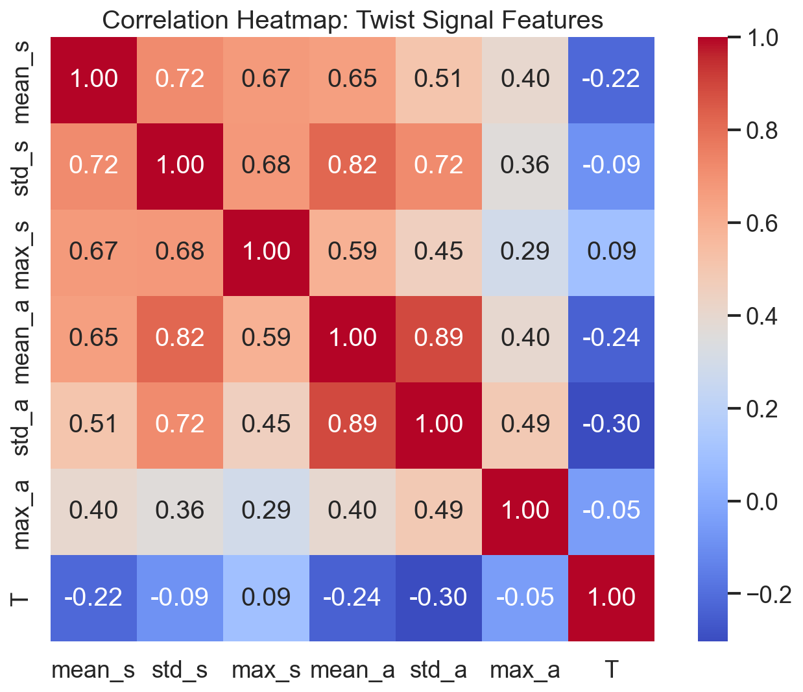

7. `interactive_twist_signal_scatter_k7.html`
- What it shows: `mean_s` vs `std_a` at `k=7`, colored by genre and symbolized by format.
- Interpretation:
  - Positive trend (`corr ~ 0.567`) indicates books with higher average novelty often have higher acceleration variability.
  - Upper-right region includes `The Time Machine` and `Dracula`, indicating high novelty and volatility.
- Implication: this view is a strong first-pass outlier/archetype selector for deep dives.
- Interactive view: [interactive_twist_signal_scatter_k7.html](../outputs/eda/figures/interactive_twist_signal_scatter_k7.html)

### Cluster Analysis
8. `cluster_sizes_kmeans_vs_hier_feature_ward.png`
- What it shows: cluster counts by `k` for KMeans and hierarchical feature-ward.
- Interpretation:
  - KMeans stays fairly balanced across `k`.
  - Feature-ward is also workable but shows mild imbalance at some `k` values.
- Implication: feature-space clustering is usable for archetype exploration.
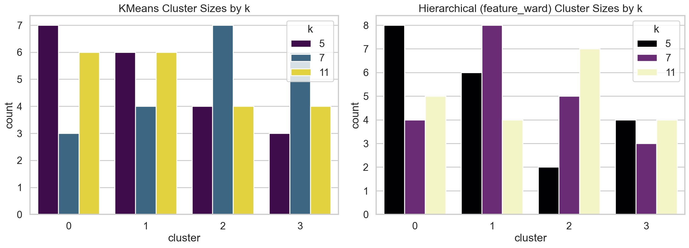

9. `kmeans_k7_cluster_genre_composition.png`
- What it shows: genre mix per KMeans cluster at `k=7`.
- Interpretation:
  - Cluster 3 is Fantasy-heavy.
  - Cluster 2 mixes Horror/Sci-Fi with some Adventure/Gothic/Mystery.
  - No cluster is pure single-genre overall.
- Implication: Twist Signal captures pacing/trajectory structure that crosses genre boundaries.
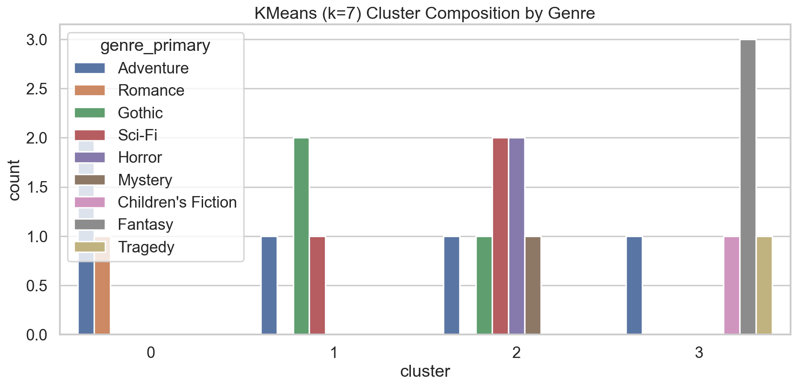

10. `agreement_heatmap_k5_kmeans_vs_ward.png`
11. `agreement_heatmap_k7_kmeans_vs_ward.png`
12. `agreement_heatmap_k11_kmeans_vs_ward.png`
- What they show: cross-tab agreement between KMeans and feature-ward per `k`.
- Interpretation:
  - Agreement is moderate, not trivial:
    - `k=5`: ARI `0.481`, NMI `0.650`
    - `k=7`: ARI `0.398`, NMI `0.628`
    - `k=11`: ARI `0.470`, NMI `0.624`
- Implication: there is consistent shared structure, but cluster boundaries are method-sensitive.
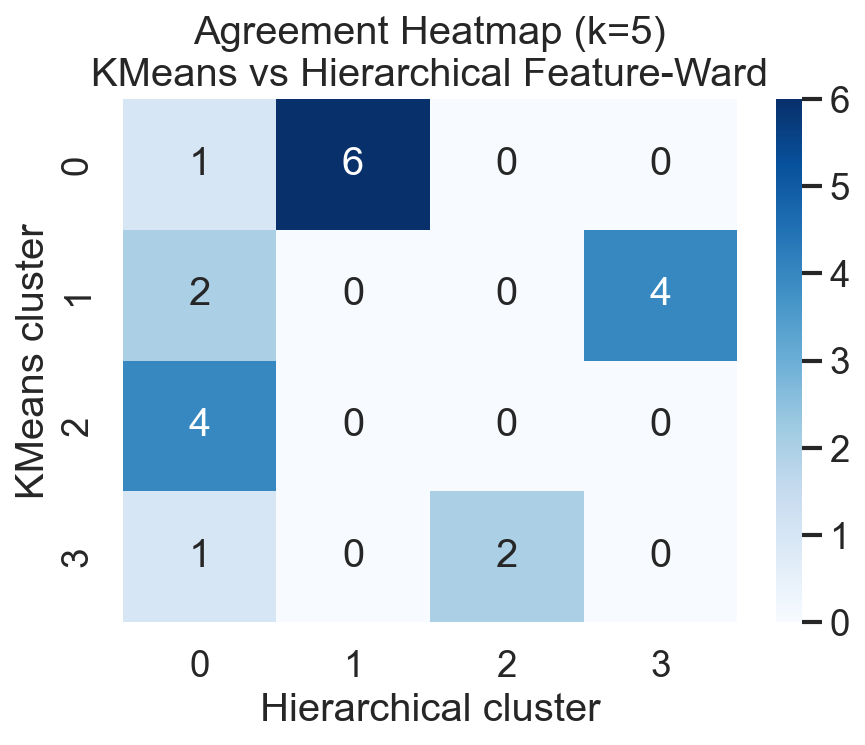
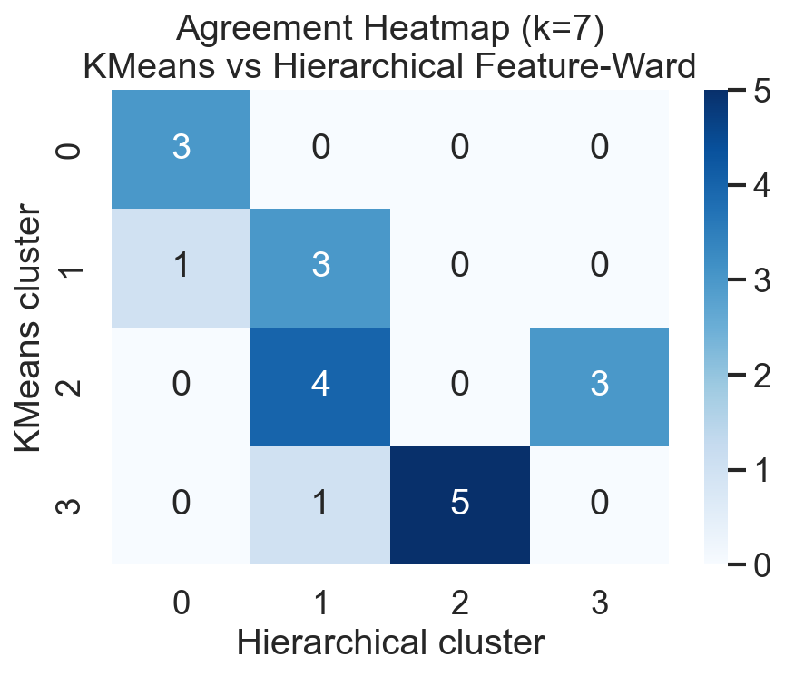
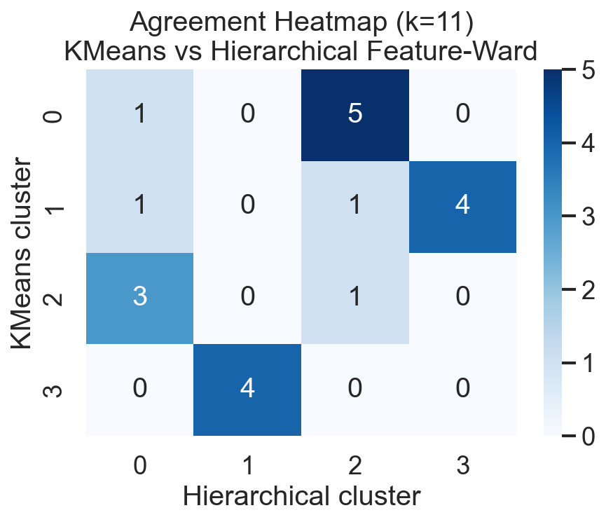

### DTW Structure
13. `dtw_heatmap_k7.html`
- What it shows: pairwise DTW distances on resampled Twist Signal (`k=7`).
- Interpretation:
  - Global mean distance `~0.618`.
  - Nearest-neighbor mean distance `~0.550` (min `~0.464`).
  - Closest pairs include:
    - Alice ↔ Treasure Island
    - Alice ↔ Romeo and Juliet
    - Treasure Island ↔ Romeo and Juliet
- Implication: some cross-genre books share similar temporal novelty shape.
- Interactive view: [dtw_heatmap_k7.html](../outputs/eda/figures/dtw_heatmap_k7.html)

14. `dtw_mds_projection.png`
15. `interactive_dtw_mds_projection.html`
- What they show: 2D MDS embedding from DTW distances.
- Interpretation:
  - A dominant central basin appears, consistent with DTW cluster collapse.
  - Limited separation for most books under current DTW + average linkage settings.
- Implication: DTW representation likely needs alternative linkage/normalization or richer sequence features for balanced clustering.
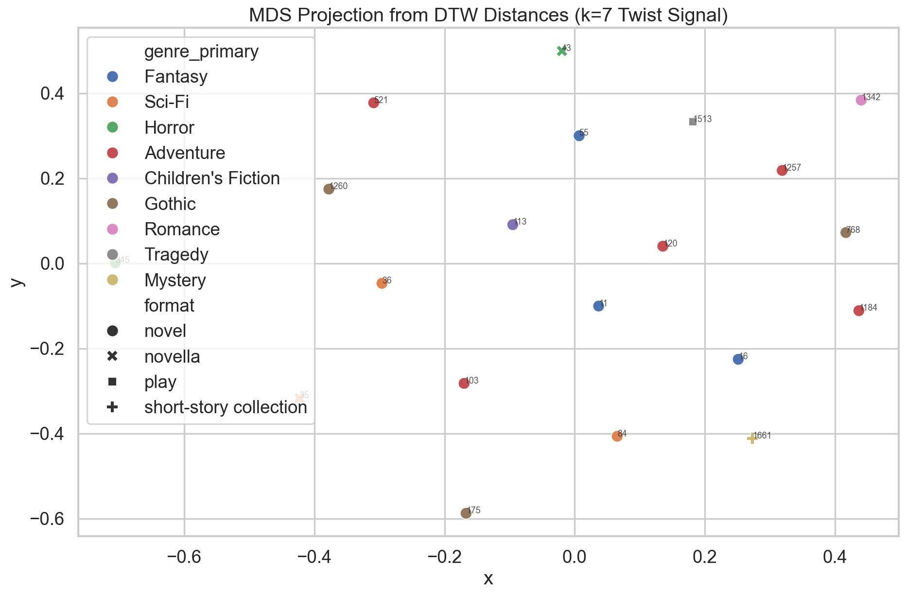
- Interactive view: [interactive_dtw_mds_projection.html](../outputs/eda/figures/interactive_dtw_mds_projection.html)

### Book-Level Deep Dives (k=7 Representatives)
16. `twist_signal_deep_dive_book_1184_k7.png` (Cluster 0, *The Count of Monte Cristo*)
- Interpretation:
  - Very long trajectory (`T=4608`), moderate novelty (`mean_s=0.176`) and smoother acceleration (`max_a=0.307`).
  - Peaks spread across narrative (indices ~786, 2681, 3391), consistent with long-arc progression.
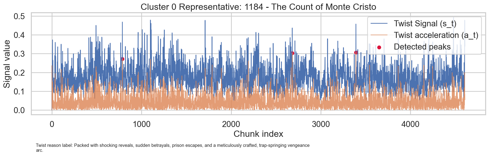

17. `twist_signal_deep_dive_book_36_k7.png` (Cluster 1, *The War of the Worlds*)
- Interpretation:
  - Medium length (`T=599`), high novelty (`mean_s=0.202`) and moderate-high acceleration.
  - Peaks in mid-late sections (~278, 371, 431), showing concentrated escalation zones.
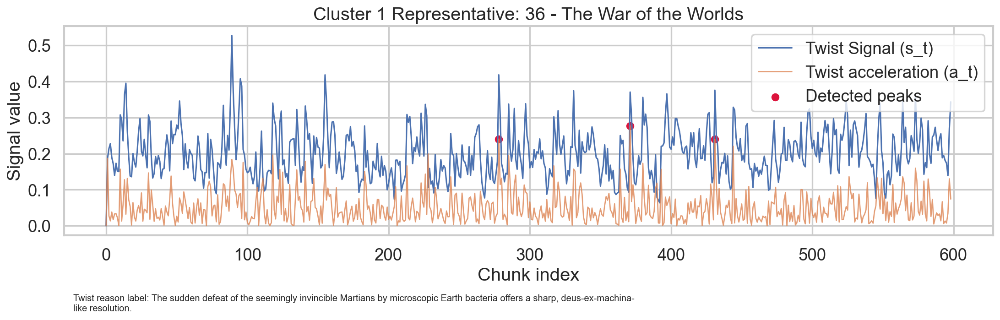

18. `twist_signal_deep_dive_book_35_k7.png` (Cluster 2, *The Time Machine*)
- Interpretation:
  - Shorter trajectory (`T=323`) with very high novelty and volatility (`mean_s=0.222`, `max_a=0.415`).
  - Early first peak plus later major peaks indicates rapid regime shifts.
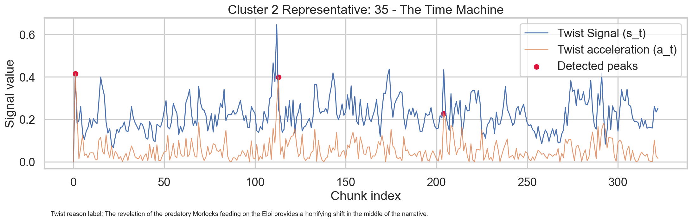

19. `twist_signal_deep_dive_book_11_k7.png` (Cluster 3, *Alice's Adventures in Wonderland*)
- Interpretation:
  - Short trajectory (`T=264`), high novelty (`mean_s=0.202`) but lower average acceleration than cluster-2 representative.
  - Early/mid peaks suggest episodic local shifts rather than sustained escalation.
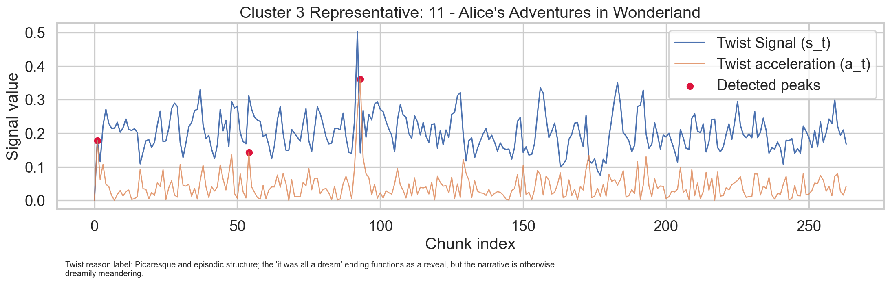

## Cross-Output Interpretation Notes
1. Feature-space methods surface multiple trajectory archetypes; DTW-average currently under-separates the corpus.
2. High `mean_s` does not always imply highest `max_a`; novelty level and volatility should be interpreted separately.
3. Metadata labels (genre/ranks) are useful context but not strict validators of trajectory clusters.

## Confidence and Caveats
- Confidence: **Medium** for descriptive pattern claims (distribution, cluster size, correlation, nearest-neighbor structure).
- Confidence: **Low-to-Medium** for archetype-level narrative interpretations without external validation.

Known caveats:
1. Default clustering hyperparameters were not optimized.
2. DTW was computed on resampled univariate Twist Signal only.
3. Corpus composition imbalance (genre/country/format) can affect apparent structure.

## Recommended Next Validation Pass
1. Compare cluster quality metrics for alternative `n_clusters` and linkage choices.
2. Add DTW variants (derivative DTW, z-normalized per-book signal, multivariate distance with `s_t` and `a_t`).
3. Evaluate stability across seeds and feature subsets.
4. Add interpretable temporal motifs (e.g., early/mid/late segment stats) to complement global aggregates.
