# indep_winsize_5 Clustering Report (Feature-Primary, MA(W) with W=5)

## Executive Verdict
- The **feature branch** is primary for interpretation: selected `kmeans` with `k=5`.
- Feature quality at selected solution: silhouette `0.260`, Davies-Bouldin `0.888`, Calinski-Harabasz `8.08`.
- KMeans seed-stability is high (mean pairwise ARI `0.893`).
- DTW validation selected `k=2` with silhouette `0.085`; agreement with feature clusters is limited (ARI `0.059`, NMI `0.241`).

## Model Selection Diagnostics
- Elbow diagnostics (`k=1..10`) show largest inertia drop at `k=2` (drop `196.705`).
- Final model-selection policy remains silhouette-first over `k=2..6` for comparability with prior runs.
- DTW branch is used as trajectory-shape validation rather than the primary cluster definition.

## Feature Cluster Interpretation
- Cluster 1 (n=5): top signatures `mean_early (-1.11); p90_y (-1.11); mean_ma5 (-0.98)`; representative `1260 | Jane Eyre`.
- Cluster 2 (n=6): top signatures `prop_label_2 (+1.08); prop_label_0 (-0.95); p10_y (+0.94)`; representative `768 | Wuthering Heights`.
- Cluster 3 (n=6): top signatures `std_diff (+1.25); jump_ge_2_rate (+1.16); mean_abs_diff (+1.15)`; representative `1661 | The Adventures of Sherlock Holmes`.
- Cluster 4 (n=1): top signatures `prop_label_4 (+3.62); mean_late (+3.21); slope_position (+2.58)`; representative `1513 | Romeo and Juliet`.
- Cluster 5 (n=2): top signatures `max_y (-3.00); range_y (-3.00); lag1_autocorr (-1.84)`; representative `11 | Alice's Adventures in Wonderland`.

## Genre Composition by Cluster
- Cluster 1 is most concentrated in `Adventure` (2 books, 40.00% of cluster).
- Cluster 2 is most concentrated in `Adventure` (3 books, 50.00% of cluster).
- Cluster 3 is most concentrated in `Sci-Fi` (3 books, 50.00% of cluster).
- Cluster 4 is most concentrated in `Tragedy` (1 books, 100.00% of cluster).
- Cluster 5 is most concentrated in `Children's Fiction` (1 books, 50.00% of cluster).

## Feature vs DTW Agreement
- ARI: `0.059`
- NMI: `0.241`
- Interpretation: DTW captures broad trajectory shape, but does not strongly reproduce the feature-space grouping in this run.

## Figure Gallery (Embedded)
### Feature PCA scatter (legend-checked)
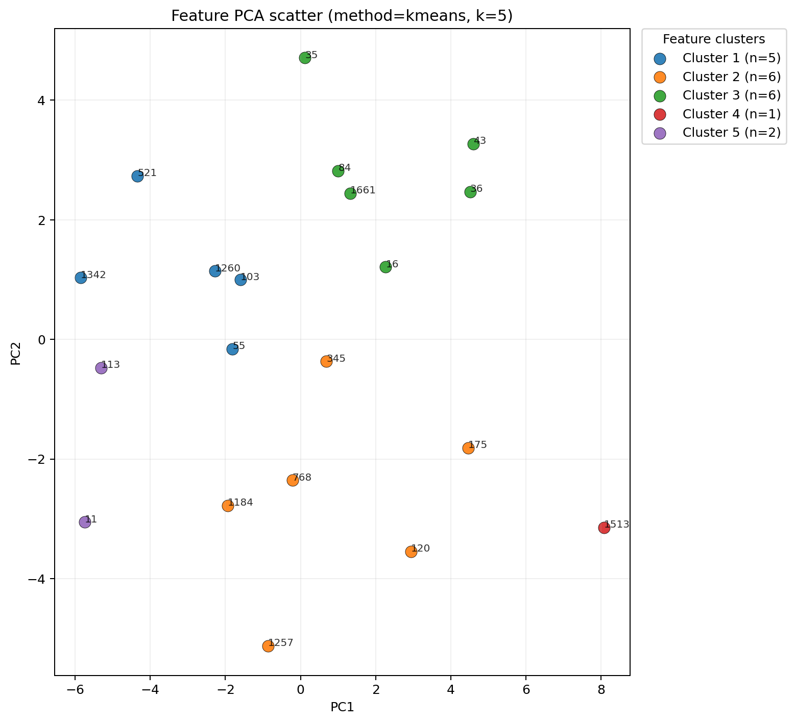

### KMeans elbow diagnostics
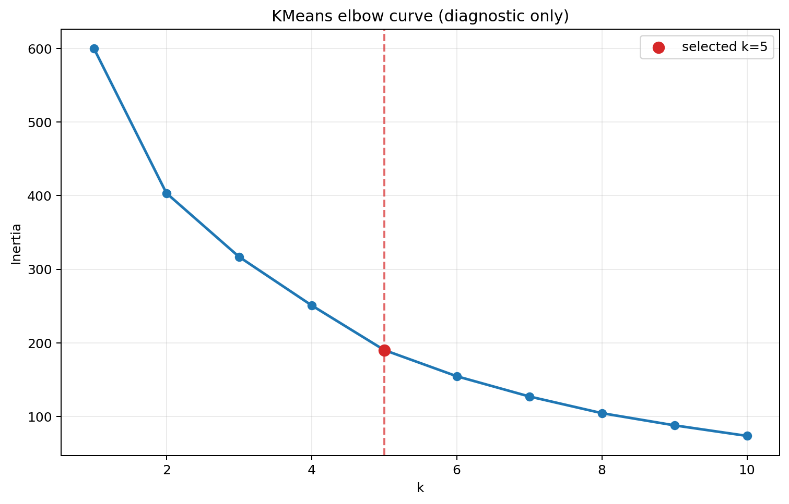

### Feature k-sweep quality metrics
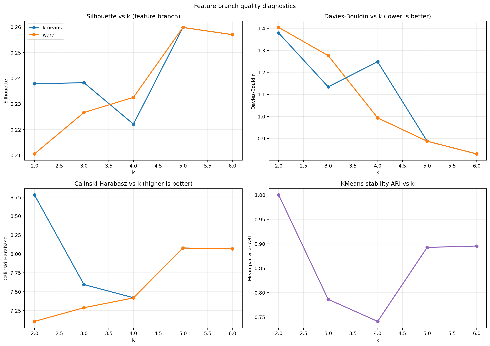

### DTW k-sweep silhouette

### Genre counts by feature cluster
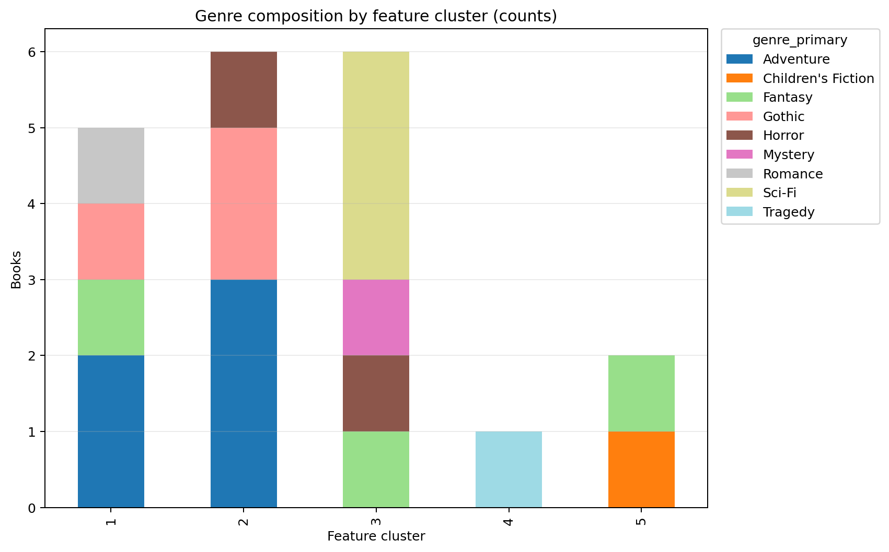

### Genre proportions by feature cluster
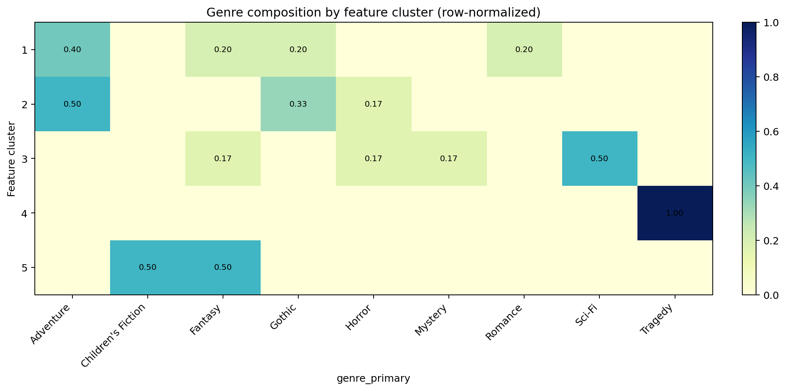

### Top feature signatures heatmap
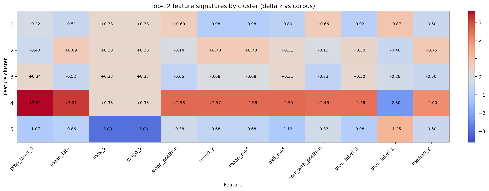

### Feature vs DTW contingency heatmap
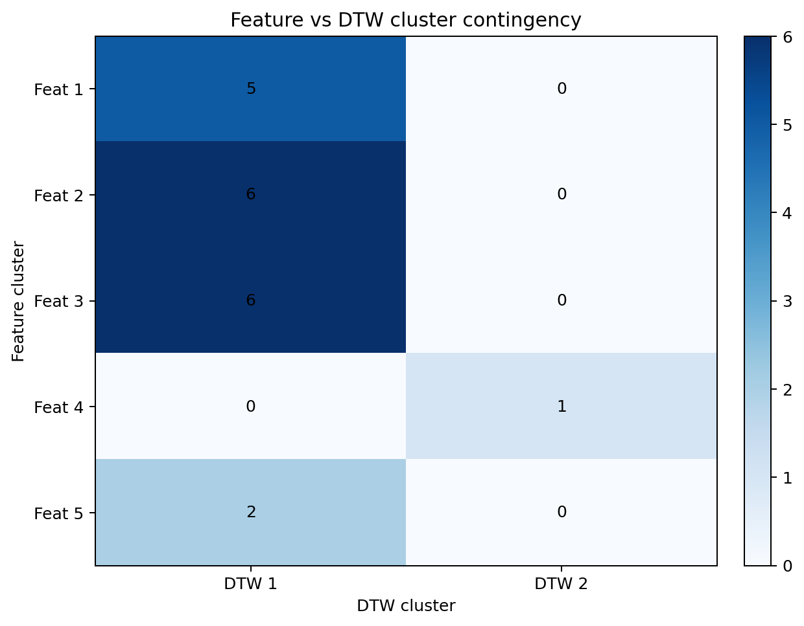

### Feature cluster member trajectories (MA5)
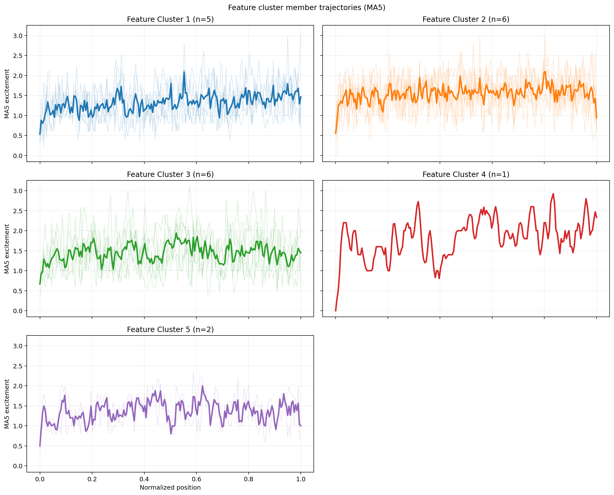

### Feature/DTW centroid trajectories (raw)
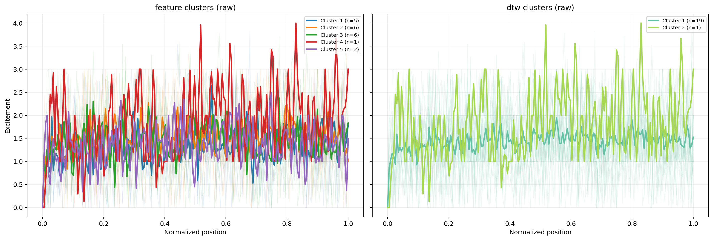

### Feature/DTW centroid trajectories (MA5)
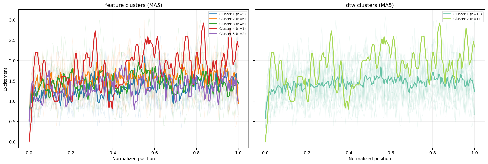

### DTW distance heatmap
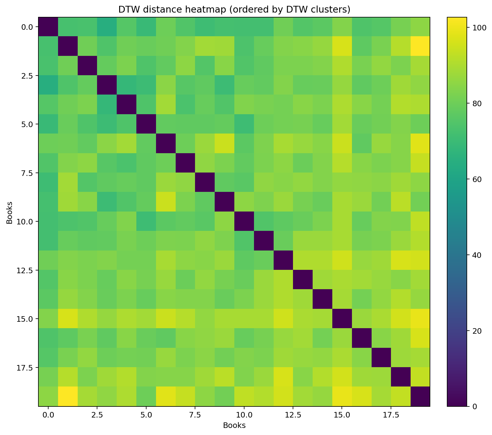

### DTW dendrogram
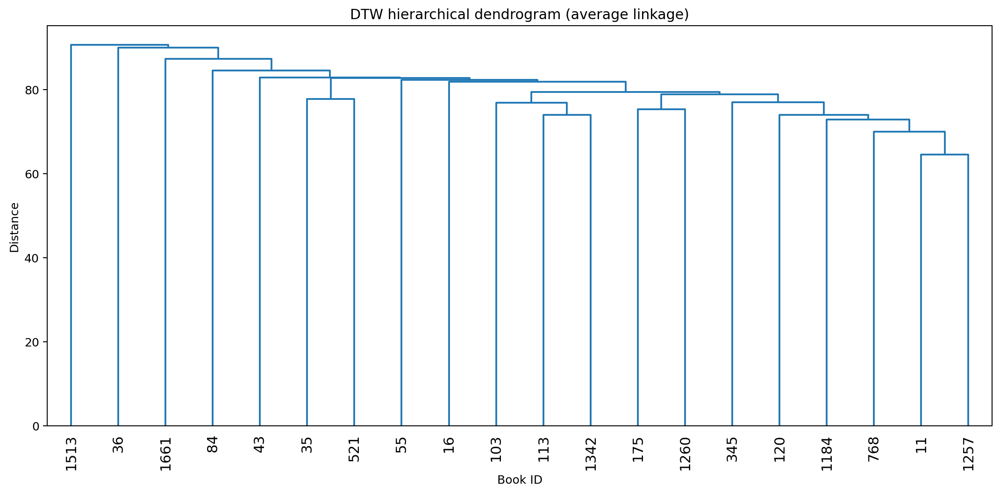

### Cluster size comparison
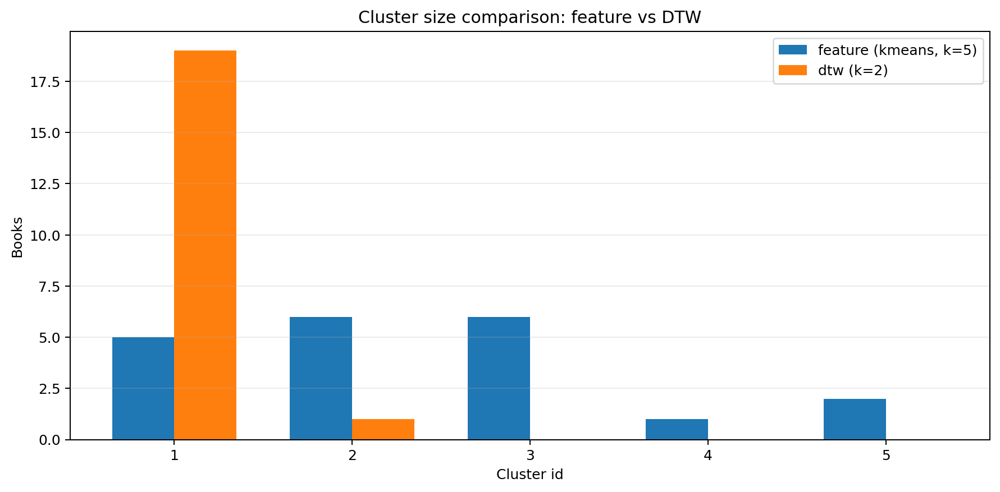

## Practical Use / Caveats / Next Steps
- Use now: interpretable archetype grouping from feature clusters and MA5 pacing profiles.
- Use with caution: DTW-driven hard grouping, because selected DTW split is coarse in this run.
- Caveat: small sample size (20 books) means cluster boundaries should be treated as exploratory.
1. Add bootstrap re-sampling of books to quantify cluster stability confidence intervals.
2. Add constrained model selection that penalizes singleton clusters for DTW branch.
3. Evaluate agreement with external weak labels (genre/twist ranks) for external validity.
